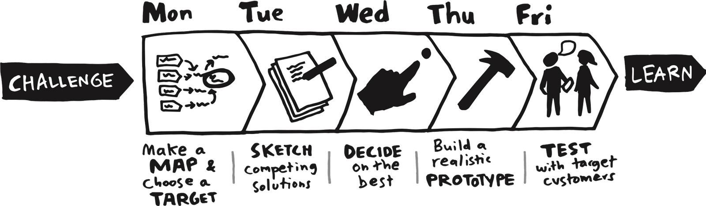

import { Badge } from '@astrojs/starlight/components';

{/* > "Perhaps imagination is only intelligence having fun." -- George Scialabba */}

The goal of creative activities is to generate ideas and help you figure out what to build. We encourage you to frame and re-frame the problem as much as needed, then come up with as many solutions as possible before converging. This cycle of diverging/converging is often referred to as [double diamond](https://www.designcouncil.org.uk/our-resources/the-double-diamond/) process.

> "You can't use up creativity. The more you use, the more you have." -- Maya Angelou

## The Parent Test

<Badge text="Individual Activity" variant="success" class="mb-6"/>

Read [The Mom Test by Rob Fitzpatrick](https://www.goodreads.com/book/show/52283963-the-mom-test) or the [book's summary](https://durmonski.com/book-summaries/the-mom-test/). 

- Identify Interviewees: select potential users, customers, or stakeholders relevant to your project.
- Plan Questions: create a set of interview questions that avoid biases and assumptions, based on the lessons from The Mom Test.
- Conduct Interviews: interview at least 3 people, focusing on gathering useful, actionable feedback.
- Reflection: write a summary of what you learned, how it influenced your understanding of user needs, and any changes to your project direction.

Submit the interview plan, notes from the interviews, and a reflection on how the book's approach impacted your project.

## Design Sprint

<Badge text="Team Activity" variant="note" class="mb-6" />

Read then run a 5-day [Design Sprint](https://www.thesprintbook.com/the-design-sprint) to rapidly prototype and test solutions for your project. Consider a condensed version of this if you cannot schedule five full days.

- Day 1: Understand -- Define the problem and the long-term goal. Identify key challenges and constraints.
- Day 2: Ideate -- Brainstorm multiple solutions to the problem.
- Day 3: Decide -- Choose the most promising solution and storyboard the user flow.
- Day 4: Prototype -- Build a working prototype of the chosen solution.
- Day 5: Test -- Conduct user testing and gather feedback.

Submit a report detailing each day's activities, the prototype, and user testing results, along with insights for the next steps.

## Apply The SCAMPER Method

<Badge text="Individual Activity" variant="success" class="mb-6"/>
<Badge text="Team Activity" variant="note" class="mb-6" />

Apply the [SCAMPER method](https://www.interaction-design.org/literature/article/learn-how-to-use-the-best-ideation-methods-scamper) (Substitute, Combine, Adapt, Modify/Maximize/Minimize, Put to another use, Eliminate, Reverse) to creatively enhance a service, product, or feature in your project.

Submit a document showing how each SCAMPER step was applied, detailing the creative enhancements and new ideas generated for your project.

## Apply the C-K Theory

<Badge text="Individual Activity" variant="success" class="mb-6"/>
<Badge text="Team Activity" variant="note" class="mb-6" />

Apply the [C-K Theory](https://www.ck-theory.org/c-k-theory/?lang=en) (Concept-Knowledge Theory) to explore and generate innovative solutions for your project by expanding both Concept (organized tree of ideas) and Knowledge (bag of facts -- statements either true or false) Spaces.

1. Concept Exploration (C→C): Start with a broad problem or concept in your project. List unconventional, creative ideas without worrying about feasibility. 
2. Knowledge Expansion (C→K, K→K, K→C): Research and identify new knowledge or technical resources that could support or challenge your concepts.
3. Intersection: Combine the new concepts with existing knowledge to propose innovative solutions.

Submit a report with your concept list, knowledge research, and resulting ideas, explaining how the C-K Theory led to innovation.

## Six Thinking Hats

<Badge text="Team Activity" variant="note" class="mb-6" />

Read the [Six Thinking Hats](https://www.atlassian.com/blog/productivity/six-thinking-hats) methodology then execute it. It is a problem-solving and creative parallel thinking method developed by Edward de Bono. It involves six metaphorical hats, each representing a different perspective:

- White Hat: Focuses on facts and data.
- Red Hat: Considers emotions and feelings.
- Black Hat: Looks for potential problems or risks.
- Yellow Hat: Sees the positive aspects and benefits.
- Green Hat: Encourages creative and innovative ideas.
- Blue Hat: Manages the thinking process and organizes the discussion. Moderator.

Submit a summary of the ideas generated from each perspective and the final actionable solution.

## Brainstorming Ideas

<Badge text="Team Activity" variant="note" class="mb-6" />

Brainstorming encourages creative thinking and collaboration by generating a large number of ideas quickly. It helps overcome mental blocks and fosters an open environment where all ideas are welcome, leading to innovative solutions.

Rules of Brainstorming (per Alex Osborn):

1. Defer Judgment: No criticism of ideas during brainstorming.
2. Encourage Wild Ideas: Even unrealistic ideas can spark creativity.
3. Build on Ideas: Collaborate and improve on others' ideas.
4. Stay Focused on the Topic: Keep the discussion relevant.
5. Quantity over Quality: Aim for many ideas.
6. One Conversation at a Time: Avoid interruptions.

Tight on schedule? Consider [How to Brainstorm -- Remotely](https://hbr.org/2020/07/how-to-brainstorm-remotely).

Whatever methodology selected, submit a summary of the most promising ideas or solutions.

### 6-3-5 Brainwriting

The [6-3-5 Brainwriting](https://zapier.com/blog/brainwriting/) technique is a structured brainstorming method that generates a large number of ideas quickly.

Each participant starts with a blank sheet. Iterate for 6 rounds:

1. Each participant adds 3 ideas (within 5 minutes) to their sheet.
2. Pass sheets one step around the circle.

### Crazy 8s

[Crazy 8s](https://blog.prototypr.io/how-to-run-a-crazy-eights-workshop-60d0a67b29a) is a fast-paced ideation method designed to generate a variety of ideas in a short time.

1. Setup: Give each participant a sheet of paper divided into eight sections.
2. Set a Timer: Set an 8-minute timer.
3. Brainstorm: Each participant sketches 8 different ideas (one per section) within the 8 minutes -- 1 minute per idea. Consider writing a caption for each sketch to remember your idea and explain it later.
4. Review: After time is up, participants share their ideas with the group. You could put all the sheets on the table, wall, or whiteboard for example. 

You can let everyone vote for their favorite ideas, for example by putting stickers on them. 

Here's a description on [how to do the Crazy8s remotely](https://uxdesign.cc/how-to-do-crazy-8s-remotely-223d7fbd5e98).

### Rolestorming

[Rolestorming](https://business.tutsplus.com/tutorials/what-is-rolestorming-group-brainstorming-method--cms-27245) is a brainstorming technique where participants assume different roles or perspectives (e.g., customer, competitor, or end-user) to generate fresh ideas. By stepping into someone else's shoes, participants break free from their usual mindset and consider new angles or approaches.

1. Assign Roles: each participant takes on a specific role (e.g., the user,the CEO, the critic, etc.)
2. Brainstorm: generate ideas from your assigned role's perspective.
3. Group Discussion: share ideas and refine them based on all perspectives.

You can also rotate roles (similarly to the Six Thinking Hats) and do it again.

Here's a [more exhaustive article](https://fourweekmba.com/rolestorming/).

### Reverse Brainstorming

[Reverse Brainstorming](https://online.visual-paradigm.com/knowledge/brainstorming/what-is-reverse-brainstorming/) is a technique where, instead of generating solutions, participants think about how to cause the problem or make it worse. By identifying ways to worsen the situation, it becomes easier to flip those ideas into solutions.

1. Identify the Problem: Define the challenge or problem.
2. Reverse the Problem: Brainstorm ways to make the problem worse.
3. Flip the Ideas: Take the “worsened” ideas and reverse them to discover potential solutions.
4. Discuss: Refine the flipped ideas into actionable strategies.

## Write a Literature Review

<Badge text="Individual Activity" variant="success" class="mb-6"/>

A [literature review](https://owl.purdue.edu/owl/research_and_citation/conducting_research/writing_a_literature_review.html) is a comprehensive summary and analysis of existing research on a specific topic. It helps to identify gaps, understand the current state of knowledge, and build a foundation for your research project. It ensures your work is informed, relevant, and contributes to the field.

Submit a literature review about your research topic.

{/* ## Storyboarding

Visualize the user journey and interactions. */}

{/* ## Rapid Prototyping

Quickly build and test low-fidelity prototypes. */}

{/* ## Opportunity Solution Tree (OST)") 

https://www.producttalk.org/2023/12/opportunity-solution-trees/ */}
