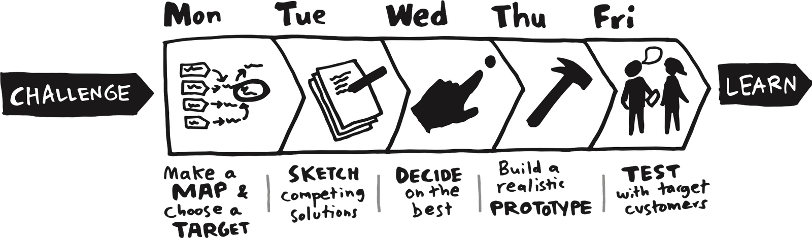

import { Badge, LinkCard } from '@astrojs/starlight/components';

{/* > "Perhaps imagination is only intelligence having fun." -- George Scialabba */}

The goal of creative activities is to generate ideas and help you figure out what to build. We encourage you to frame and re-frame the problem as much as needed, then come up with as many solutions as possible before converging. This cycle of diverging/converging is often referred to as [double diamond](https://www.designcouncil.org.uk/our-resources/the-double-diamond/) process.

> "You can't use up creativity. The more you use, the more you have." -- Maya Angelou

<LinkCard
  title="Planning and Prioritization guide"
  href="/guides/planning/#ideation-techniques"
  description="The brainstorming rules and the four techniques (6-3-5 brainwriting, Crazy 8s, rolestorming, reverse brainstorming) explained."
/>

## The Mom Test

<Badge text="Individual Activity" variant="success" class="mb-6"/> <Badge text="Recommended" variant="tip" class="mb-6"/>

Read [The Mom Test by Rob Fitzpatrick](https://www.goodreads.com/book/show/52283963-the-mom-test) or the [book's summary](https://durmonski.com/book-summaries/the-mom-test/). Keep the handbook's [Mom Test cheat sheet](/the-mom-test-cheat-sheet.md) open while you plan and run the interviews; it condenses the rules into a one-page reference.

- Identify Interviewees: Select potential users, customers, or stakeholders relevant to your project.
- Plan Questions: Create a set of interview questions that avoid biases and assumptions, based on the lessons from The Mom Test.
- Conduct Interviews: Interview at least 3 people, focusing on gathering useful, actionable feedback.
- Reflection: Write a summary of what you learned, how it influenced your understanding of user needs, and any changes to your project direction.

A good output is the interview plan, notes from the interviews, and a reflection on how the book's approach changed your project. These interviews feed directly into the user access plan of your [Definition of Shipped](/assignments/definition-of-shipped/) and the winter real-user gate.

**Feeds:** the [Landing Page](/assignments/landing-page/) value proposition, and a fast check on whether your [RFC](/assignments/rfc/) decision matters to anyone outside the team.

## Design Sprint

<Badge text="Team Activity" variant="note" class="mb-6" />

Read then run a 5-day [Design Sprint](https://www.thesprintbook.com/the-design-sprint) to rapidly prototype and test solutions for your project. Consider a condensed version of this if you cannot schedule five full days.

- Day 1: Understand -- Define the problem and the long-term goal. Identify key challenges and constraints.
- Day 2: Ideate -- Brainstorm multiple solutions to the problem.
- Day 3: Decide -- Choose the most promising solution and storyboard the user flow.
- Day 4: Prototype -- Build a working prototype of the chosen solution.
- Day 5: Test -- Conduct user testing and gather feedback.

A good output is a report detailing each day's activities, the prototype, and user testing results, along with insights for the next steps.

## Apply The SCAMPER Method

<Badge text="Individual Activity" variant="success" class="mb-6"/> <Badge text="Team Activity" variant="note" class="mb-6" />

Apply the [SCAMPER method](https://www.interaction-design.org/literature/article/learn-how-to-use-the-best-ideation-methods-scamper) (Substitute, Combine, Adapt, Modify/Maximize/Minimize, Put to another use, Eliminate, Reverse) to creatively enhance a service, product, or feature in your project.

A good output shows how each SCAMPER step was applied, detailing the creative enhancements and new ideas generated for your project.

## Apply the C-K Theory

<Badge text="Individual Activity" variant="success" class="mb-6"/> <Badge text="Team Activity" variant="note" class="mb-6" />

Apply the [C-K Theory](https://www.ck-theory.org/c-k-theory/?lang=en) (Concept-Knowledge Theory) to explore and generate innovative solutions for your project by expanding both Concept (organized tree of ideas) and Knowledge (bag of facts -- statements either true or false) Spaces.

1. Concept Exploration (C→C): Start with a broad problem or concept in your project. List unconventional, creative ideas without worrying about feasibility. 
2. Knowledge Expansion (C→K, K→K, K→C): Research and identify new knowledge or technical resources that could support or challenge your concepts.
3. Intersection: Combine the new concepts with existing knowledge to propose innovative solutions.

Capture your concept list, knowledge research, and resulting ideas, explaining how the C-K Theory led to innovation.

A good output is your expanded Concept and Knowledge spaces, with the concepts that survived contact with the facts marked as candidates.

## Six Thinking Hats

<Badge text="Team Activity" variant="note" class="mb-6" /> <Badge text="Recommended" variant="tip" class="mb-6"/>

Read the [Six Thinking Hats](https://www.atlassian.com/blog/productivity/six-thinking-hats) methodology then execute it. It is a problem-solving and creative parallel thinking method developed by Edward de Bono. It involves six metaphorical hats, each representing a different perspective:

- White Hat: Focuses on facts and data.
- Red Hat: Considers emotions and feelings.
- Black Hat: Looks for potential problems or risks.
- Yellow Hat: Sees the positive aspects and benefits.
- Green Hat: Encourages creative and innovative ideas.
- Blue Hat: Manages the thinking process and organizes the discussion. Moderator.

Capture a summary of the ideas generated from each perspective and the final actionable solution.

A good output is a written pass under each of the six hats on one real decision, ending with the conclusion the exercise pushed you toward.

**Feeds:** the [RFC](/assignments/rfc/) options criterion, including "do nothing".

## Brainstorming Ideas

<Badge text="Team Activity" variant="note" class="mb-6" />

Generate more candidate ideas than you need, then narrow to a shortlist you can defend. Thirty to sixty minutes as a team, once per open question.

- **Frame the question**: write the problem as one sentence at the top of the board. A [How Might We](/activities/planning/#how-might-we-questions) question works well.
- **Pick one technique** from the [guide](/guides/planning/#ideation-techniques): 6-3-5 brainwriting when a few voices dominate, Crazy 8s for interface ideas, rolestorming for stakeholder perspectives, reverse brainstorming for risks.
- **Run it under the rules**: defer judgment, quantity over quality, one conversation at a time, build on each other, be visual. IDEO's [seven rules](https://www.ideou.com/blogs/inspiration/7-simple-rules-of-brainstorming) are the full list.
- **Converge**: agree on two or three criteria, dot-vote, and keep the top handful. Record why the rest were dropped.

A good output is the raw idea list, the criteria you used to narrow it, and the shortlist you kept.

## Write a Literature Review

<Badge text="Individual Activity" variant="success" class="mb-6"/> <Badge text="Recommended" variant="tip" class="mb-6"/>

A [literature review](https://owl.purdue.edu/owl/research_and_citation/conducting_research/writing_a_literature_review.html) is a comprehensive summary and analysis of existing research on a specific topic. It helps to identify gaps, understand the current state of knowledge, and build a foundation for your research project. It ensures your work is informed, relevant, and contributes to the field.

Your output is a literature review about your research topic.

A good output is a literature review that names the gap your project addresses and cites the sources establishing it.

**Feeds:** the [RFC](/assignments/rfc/) tradeoff-analysis criterion, and the source work behind the winter RFC's length floor.
