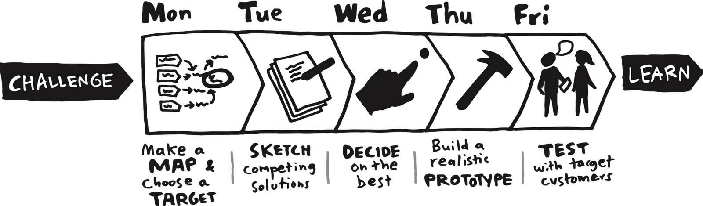

import { LinkCard } from '@astrojs/starlight/components';
import ActivityMeta from '/src/components/ActivityMeta.astro';

Ideation activities generate ideas and challenge them before you commit to one. Frame and re-frame the problem as much as needed, then come up with as many solutions as possible before converging. This cycle of diverging and converging is often referred to as the [double diamond](https://www.designcouncil.org.uk/our-resources/the-double-diamond/) process.

> "You can't use up creativity. The more you use, the more you have." (Maya Angelou)

<LinkCard
  title="Planning and Prioritization guide"
  href="/guides/planning/#ideation-techniques"
  description="The brainstorming rules and the four techniques (6-3-5 brainwriting, Crazy 8s, rolestorming, reverse brainstorming) explained."
/>

## How Might We Questions

<ActivityMeta anchor="how-might-we-questions" />

The ["How Might We" (HMW) technique](https://www.nngroup.com/articles/how-might-we-questions/) is a creative problem-framing method used to turn challenges or observations into opportunities for innovation. By rephrasing problems as open-ended questions starting with "How might we...", you encourage brainstorming and solution-oriented thinking.

1. Identify a key challenge, pain point, or opportunity area in your project.
2. Reframe it as one or more "How might we..." questions.
3. Use these questions to guide ideation sessions or team discussions.

A good output is a list of at least three "How might we..." questions relevant to your project, along with a brief explanation of the challenge each question addresses.

## Brainstorming Ideas

<ActivityMeta anchor="brainstorming-ideas" />

Generate more candidate ideas than you need, then narrow to a shortlist you can defend. Thirty to sixty minutes as a team, once per open question.

- **Frame the question**: write the problem as one sentence at the top of the board. A [How Might We](/activities/ideation/#how-might-we-questions) question works well.
- **Pick one technique** from the [guide](/guides/planning/#ideation-techniques): 6-3-5 brainwriting when a few voices dominate, Crazy 8s for interface ideas, rolestorming for stakeholder perspectives, reverse brainstorming for risks.
- **Run it under the rules**: defer judgment, quantity over quality, one conversation at a time, build on each other, be visual. IDEO's [seven rules](https://www.ideou.com/blogs/inspiration/7-simple-rules-of-brainstorming) are the full list.
- **Converge**: agree on two or three criteria, dot-vote, and keep the top handful. Record why the rest were dropped.

A good output is the raw idea list, the criteria you used to narrow it, and the shortlist you kept.

## Apply The SCAMPER Method

<ActivityMeta anchor="apply-the-scamper-method" />

Apply the [SCAMPER method](https://www.interaction-design.org/literature/article/learn-how-to-use-the-best-ideation-methods-scamper) (Substitute, Combine, Adapt, Modify/Maximize/Minimize, Put to another use, Eliminate, Reverse) to creatively enhance a service, product, or feature in your project.

A good output shows how each SCAMPER step was applied, detailing the creative enhancements and new ideas generated for your project.

## Apply the C-K Theory

<ActivityMeta anchor="apply-the-c-k-theory" />

Apply the [C-K Theory](https://www.ck-theory.org/c-k-theory/?lang=en) (Concept-Knowledge Theory) to explore and generate innovative solutions for your project by expanding both Concept (organized tree of ideas) and Knowledge (bag of facts: statements either true or false) Spaces.

1. Concept Exploration (C→C): Start with a broad problem or concept in your project. List unconventional, creative ideas without worrying about feasibility. 
2. Knowledge Expansion (C→K, K→K, K→C): Research and identify new knowledge or technical resources that could support or challenge your concepts.
3. Intersection: Combine the new concepts with existing knowledge to propose innovative solutions.

Capture your concept list, knowledge research, and resulting ideas, explaining how the C-K Theory led to innovation.

A good output is your expanded Concept and Knowledge spaces, with the concepts that survived contact with the facts marked as candidates.

## Six Thinking Hats

<ActivityMeta anchor="six-thinking-hats" />

Read the [Six Thinking Hats](https://www.atlassian.com/blog/productivity/six-thinking-hats) methodology, then run it. It's a problem-solving and creative parallel thinking method developed by Edward de Bono. It involves six metaphorical hats, each representing a different perspective:

- White Hat: Focuses on facts and data.
- Red Hat: Considers emotions and feelings.
- Black Hat: Looks for potential problems or risks.
- Yellow Hat: Sees the positive aspects and benefits.
- Green Hat: Encourages creative and innovative ideas.
- Blue Hat: Manages the thinking process and organizes the discussion. Moderator.

Capture a summary of the ideas generated from each perspective and the final actionable solution.

A good output is a written pass under each of the six hats on one real decision, ending with the conclusion the exercise pushed you toward.

## Design Sprint

<ActivityMeta anchor="design-sprint" effort="Multi-day" />

Read then run a 5-day [Design Sprint](https://www.thesprintbook.com/the-design-sprint) to rapidly prototype and test solutions for your project. Consider a condensed version if you can't schedule five full days.

- Day 1, Understand: define the problem and the long-term goal. Identify key challenges and constraints.
- Day 2, Ideate: brainstorm multiple solutions to the problem.
- Day 3, Decide: choose the most promising solution and storyboard the user flow.
- Day 4, Prototype: build a working prototype of the chosen solution.
- Day 5, Test: conduct user testing and gather feedback.

A good output is a report detailing each day's activities, the prototype, and user testing results, along with insights for the next steps.
