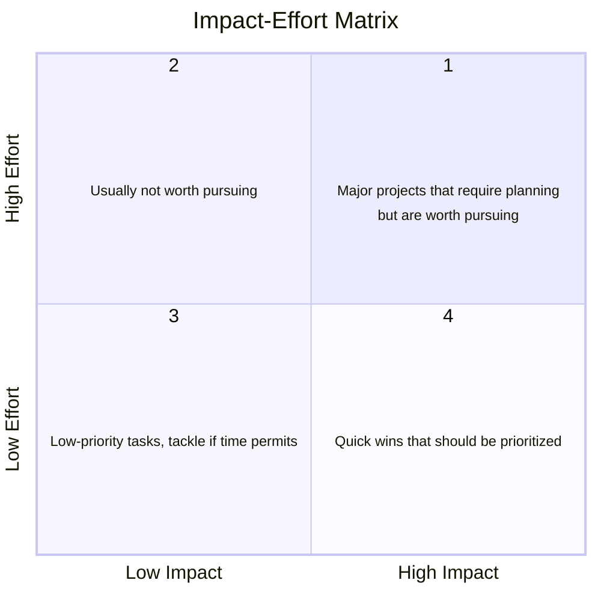
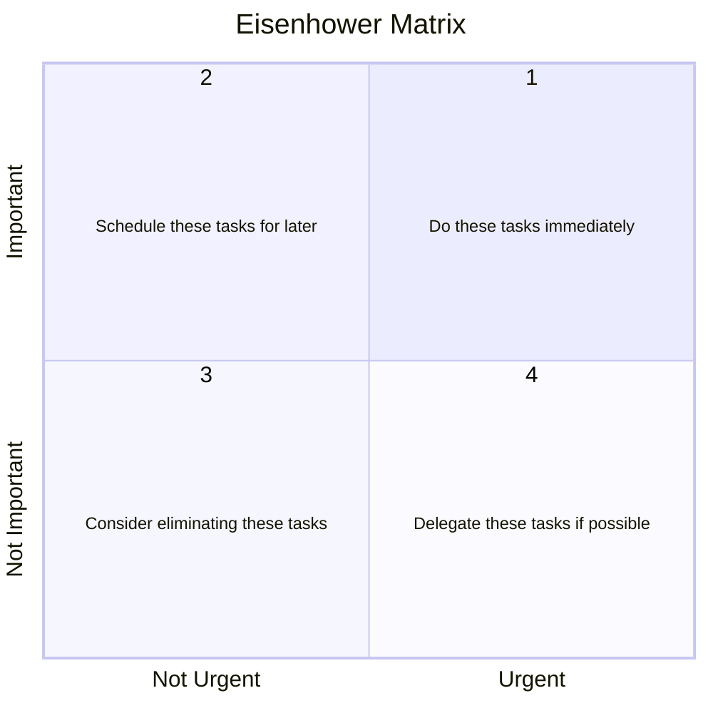
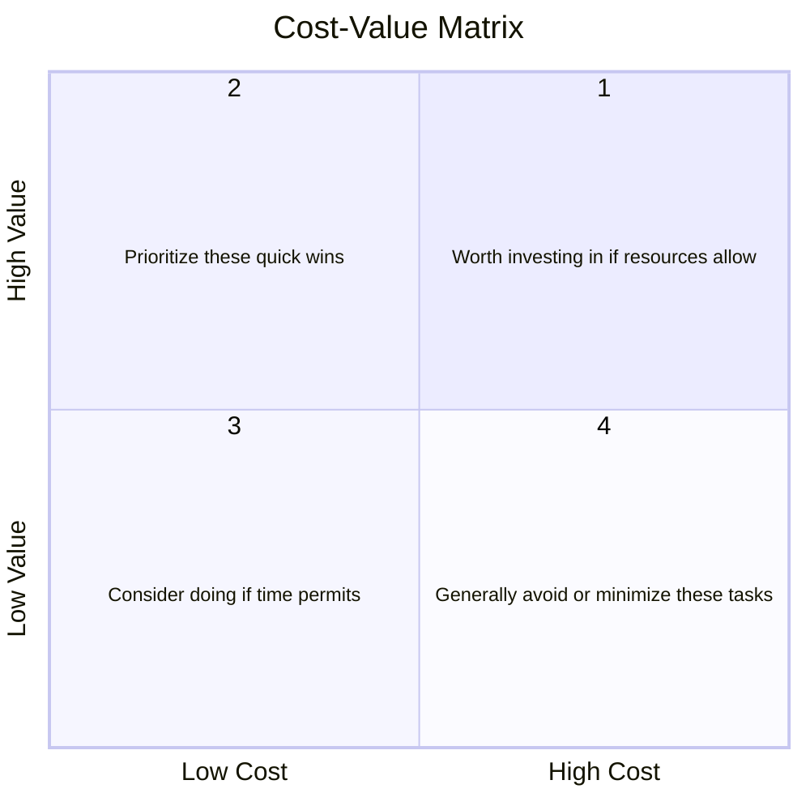

import { Badge } from '@astrojs/starlight/components';

Planning activities are designed to help you figure out your timeline and deliverables. They work best if combined with requirements and design. Be transparent about things you don't know yet (risks) and how you will get those answers.

> "Plans are nothing; planning is everything." -- Dwight D. Eisenhower

## Identify Success Metrics

<Badge text="Team Activity" variant="note" class="mb-6"/>

Especially for New Product or Game projects, it can be important to select and define the success metrics. 

Here are some common metrics:

- Number of Downloads or Sign Ups
- Monthly Active Users (MAU)
- Churn Rate
- Average Session Duration
- Net Promoter Score (NPS)
- Positive Mentions / Up-votes
- Research Citations

Choose [success metrics relevant to your project](https://assets.productplan.com/content/Product-Success-Metrics-by-ProductPlan.pdf). Be careful with "vanity" metrics, e.g., the number of downloads is meaningless if nobody can run the software or everybody stops using it after the first use. Think about how meaningful your metrics are. Use multiple metrics if the need arises (see below for frameworks). 

Depending on your project category, metrics can be quantitative (large surveys or web analytics) or qualitative (for example based on one-on-one interviews) in nature.

In addition to choosing the metrics, research and document how you will collect them. Consider using web analytics tools (Google Analytics, Plausible, Hotjar, ...), various tracking methods (database counts), interviews, surveys, etc.

### Product-Market Fit (PMF) Question

The PMF question asks, “How would you feel if you could no longer use this product?” Users typically respond with options like “Very disappointed,” “Somewhat disappointed,” or “Not disappointed.” A high percentage of “Very disappointed” responses (typically 40% or more) indicates strong product-market fit, showing that the product is essential to its users.

### Pirate Metrics (AAARR)

The [Pirate Metrics (AARRR) Framework](https://www.productplan.com/glossary/aarrr-framework/) is used for tracking customer behavior and business growth, consisting of five stages:

- Acquisition (or awareness): How are people discovering our product?
- Activation: Are these people taking the actions we want them to? For example, signing up or downloading your app.
- Retention: Are our activated users continuing to engage with the product? Do they return after using it the first time?
- Referral: Do users like the product enough to tell others about it?
- Revenue: Are our users willing to pay for this product? 

These metrics help businesses identify strengths and weaknesses in the customer journey to optimize growth strategies.

### HEART Framework

The [HEART Framework](https://www.heartframework.com/) is a user experience (UX) measurement framework developed by Google. It consists of five key metrics:

- Happiness: Measures user satisfaction (e.g., surveys, ratings).
- Engagement: Tracks how often and intensely users interact with the product.
- Adoption: Measures how many new users begin using the product over time.
- Retention: Tracks how many users return to the product.
- Task Success: Measures the effectiveness and efficiency of completing core tasks (e.g., task completion rates).

The HEART Framework helps teams evaluate UX impact and improve product design.

## Weekly Work Intensity

<Badge text="Individual Activity" variant="success" class="mb-6"/>

Rate each week of the term as low, medium, or high based on the effort you expect to dedicate to your project, considering other (course) commitments. Throughout the term, track your actual effort and compare it to your predictions. At the end, reflect on how your expectations matched your experience and identify any adjustments needed to better manage your time going forward.

Discuss your weekly work intensity with your team and align expectations.

## Plan Prototype

<Badge text="Team Activity" variant="note" class="mb-6"/>

Your project might have a lot of unknowns, either on the technical feasibility side or on the user side (value or usability).

Here are common feasibility concerns:

- Algorithm concerns
- Performance concerns
- Scalability concerns
- Fault tolerance concerns
- Use of a technology the team has not used before
- Use of a third-party component or service the team has not used before
- Use of a legacy system the team has not used before
- Dependency on new or related changes by other teams

The idea with a feasibility prototype is to write code, quick and dirty, generally, to tackle items listed above. You could for example build a basic app in a language you have never used before, compare different algorithms on a subset of data, or make sure you can compile legacy code. This code is most likely intended to be thrown away.

On the user side, low-fidelity prototypes are interactive wireframes that only focus on the information and workflow of your software, not the visual design nor differences in the actual data. High-fidelity prototypes is very similar but you'd have to look closer to figure out it's fake. The visual design and data are very realistic, but the data is not live. Consider [Figma](https://www.figma.com/) for your interactive use prototypes; you can also use pen and paper, powerpoint, or anything else you feel comfortable with.

Finally, there's the live-data prototype. Consider it a substantially smaller implementation of the eventual product. The quality, performance, and functionality are very limited, but it runs well enough to collect data for specific use cases. This is the type of prototype you can start iterating on, so figure out feasibility first.

Submit a plan with the types of prototypes you will build, in what order, and in what time frame, and indicate what concerns they will tackle. 

## Gantt Chart

<Badge text="Team Activity" variant="note" class="mb-6"/>

A [Gantt chart](https://www.atlassian.com/agile/project-management/gantt-chart) is a visual project management tool that displays tasks and timelines. It consists of a horizontal bar chart, where each bar represents a task, showing its start date, duration, and end date. The chart helps in tracking project progress, managing deadlines, and identifying dependencies between tasks, making it easier to plan and monitor the project's workflow.

:::note
This activity is easier to complete if you've already worked on the requirements and know what you need to build. You should anyway plan contingencies.
:::

For this activity, define your tasks, set the timeline (for all three terms), and create a visually appealing Gantt chart. You could use the Roadmap view on GitHub Projects for that purpose. 

Submit the Gantt chart at the start, mid-point, and deadline of the assignment, along with a reflection on how well you adhered to your plan and any changes made along the way.

## Dependency Mapping or Critical Path Analysis

<Badge text="Individual Activity" variant="success" class="mb-6"/>

Map task dependencies and identify the critical path to ensure efficient project scheduling and resource management.

1. List Tasks: Break down the project into individual tasks or activities.
2. Identify Dependencies: Determine which tasks rely on the completion of others before they can start.
3. Create a Critical Path Diagram: Map out the sequence of dependent tasks and identify the longest path (critical path) that determines the project timeline.
4. Analyze and Adjust: Identify potential bottlenecks and adjust timelines accordingly.

Provide a dependency map and critical path analysis, including identified bottlenecks and adjustments.

## Prioritization

<Badge text="Team Activity" variant="note" class="mb-6"/>

Prioritization is a key component of any planning. The goal is to identify what to work on first and why. Here's a list of a few methodologies to help you prioritize tasks or requirements.

For this activity, submit your list of requirements or tasks, prioritized and explain why each item received the priority it got.

### MoSCoW

- M (Must Have): Essential features or tasks that are critical for the project's success.
- S (Should Have): Important but not crucial; can be delayed if needed.
- C (Could Have): Desirable but not necessary; adds value but isn't essential.
- W (Won't Have): Items that are out of scope for now, but might be included later.

### Impact-Effort Matrix

The Impact-Effort Matrix helps teams evaluate tasks or features based on their potential impact and the effort required to implement them. It consists of four quadrants:

1. High Effort, High Impact: Major projects that require planning but are worth pursuing.
2. High Effort, Low Impact: Usually not worth pursuing.
3. Low Effort, Low Impact: Low-priority tasks, tackle if time permits.
4. Low Effort, High Impact: **Quick wins that should be prioritized.**

This matrix helps focus on tasks that provide the most value with the least effort.

### Eisenhower Matrix

The Eisenhower Matrix helps prioritize tasks based on urgency and importance. It consists of four quadrants:

1. Important and Urgent: **Do these tasks immediately**.
2. Important but Not Urgent: Schedule these tasks for later.
3. Not Important and Not Urgent: Consider eliminating these tasks.
4. Not Important but Urgent: Delegate these tasks if possible.

This matrix helps focus on what truly matters, improving productivity and decision-making.

### Cost-Value Matrix

The Cost-Value Matrix is used to prioritize tasks, features, or projects based on their cost (time, money, effort) and the value or benefit they provide. It consists of four quadrants:

1. High Value, High Cost: Worth investing in if resources allow.
2. High Value, Low Cost: **Prioritize these quick wins.**
3. Low Value, Low Cost: Consider doing if time permits.
4. Low Value, High Cost: Generally avoid or minimize these tasks.

This matrix helps focus on efforts that offer the best return on investment. In the context of your Capstone project, cost will mostly be time.

### SCRUM or Agile Prioritization

The SCRUM prioritization method uses a combination of techniques like the Product Backlog and Sprint Planning to prioritize tasks based on sequence, value, urgency, and complexity. It can employ some of the methods above to prioritize the backlog.

Key Elements:

- Product Backlog: A dynamic list of features, tasks, or bugs sequenced and prioritized by the product owner, product manager, or project manager.
- Sprint Planning: The team selects the highest-priority items to complete within a sprint (2-4 weeks).
- Value-Driven: Tasks that deliver the most value to the user(s) are prioritized.

It's important here to consider dependencies. A good product backlog will only allow you to work on tasks that won't be blocked by other ones needing completion.

### Most-Important Task (MIT)

The Most-Important Task (MIT) is a productivity technique where you identify the single most crucial task to complete each day. By focusing on this top-priority task first, you ensure that even if nothing else gets done, you've made significant progress. This approach helps maintain clarity, prioritize effectively, and prevent getting overwhelmed by less important activities. The MIT method encourages starting each day with a clear intention, driving meaningful productivity and progress toward your goals.

## Risk Management Plan

<Badge text="Individual Activity" variant="success" class="mb-6"/>

Develop a risk management plan to identify and mitigate potential project risks.

1. Identify Risks: Consider the [Rumsfeld matrix](https://www.theuncertaintyproject.org/tools/rumsfeld-matrix) to figure out if you need to do more research or have discussions to uncover additional risk factors.
2. Assess Impact and Probability: Evaluate each risk's potential impact on the project and its likelihood of occurring.
3. Develop Mitigation Strategies: Create contingency plans to address each risk, minimizing its impact.
4. Monitor and Review: Establish a system for tracking risks and updating the plan as the project progresses.

Provide a risk management plan detailing risks, their categorization (impact/likelihood), and mitigation strategies.

## SWOT Analysis

<Badge text="Individual Activity" variant="success" class="mb-6"/>

Conduct a SWOT (Strengths, Weaknesses, Opportunities, Threats) analysis to identify key internal and external factors affecting your project.

- Strengths: Identify the internal strengths of your project (e.g., team skills, resources).
- Weaknesses: Determine internal weaknesses (e.g., limitations in knowledge, budget).
- Opportunities: Explore external opportunities that could benefit your project (e.g., new technologies, partnerships).
- Threats: Identify external risks or challenges (e.g., competitors, regulatory issues).

Provide a report outlining the SWOT analysis and how these factors will influence project planning and decisions. Consider creating a matrix with four quadrants.

## Kanban Board Setup

<Badge text="Individual Activity" variant="success" class="mb-6"/>

Set up a Kanban board to visualize and manage your project's workflow effectively.

1. Create Columns: Set up key stages like “To Do,” “In Progress,” and “Done” (or project-specific stages).
2. List Tasks: Break down the project into individual tasks or user stories and add them to the “To Do” column.
3. Manage Workflow: Move tasks across columns as work progresses to visualize progress.
4. Limit Work in Progress (WIP): Set WIP limits to avoid overloading team members.
5. Team Agreement: Discuss the process and tool with your team and ensure everyone agrees.

Provide a screenshot of your Kanban board and a brief explanation of its structure.

## Responsibility Assignment Matrix (RACI)

<Badge text="Team Activity" variant="note" class="mb-6"/>

A [RACI matrix](https://en.wikipedia.org/wiki/Responsibility_assignment_matrix) is a project management tool that clarifies roles and responsibilities for tasks or deliverables. RACI stands for:

- **Responsible**: The person(s) who perform the work to complete the task.
- **Accountable**: The person who is ultimately answerable for the task's completion and approves the work.
- **Consulted**: Individuals who provide input or expertise during the task.
- **Informed**: Individuals who need to be kept updated on the task's progress or completion.

Here's an example of a RACI matrix:

| Task/Deliverable | Team Member A | Team Member B | ... | TA/Instructor | Project Partner |
|:-----------------|:-------------:|:-------------:|:-------------:|:-------------:|:-------------:|
| Stakeholder Interview | R | A | C | I |
| Figma: User Login | R | C |  | I | I |
| Compare Databases Technology |  | R |  | I | C |
| Testing | R | R | R | I | A |

Provide a RACI matrix for your project, detailing roles and responsibilities for key tasks or deliverables.

## Stakeholder Mapping

<Badge text="Individual Activity" variant="success" class="mb-6"/>

Identify and categorize project stakeholders to ensure effective communication and alignment of expectations.

- List Stakeholders: Identify all individuals or groups with a vested interest in the project (e.g., clients, team members, end users).
- Categorize Stakeholders: Use a power-interest matrix to categorize stakeholders based on their influence and interest in the project.
- Define Communication Strategies: Establish how and when to communicate with each stakeholder category (e.g., regular updates, feedback sessions).
- Review and Update: Regularly reassess the stakeholder map as the project evolves.

Provide a stakeholder map and a plan outlining communication strategies for each group.

## Definition of Done

<Badge text="Individual Activity" variant="success" class="mb-6"/>

The [Definition of Done (DoD)](https://www.atlassian.com/agile/project-management/definition-of-done) establishes clear criteria for when tasks, features, or the overall project can be considered complete.

1. List Completion Criteria: Define specific conditions that must be met for each task or feature to be marked as “done” (e.g., all tests passed, documentation updated, code reviewed).
2. Include Quality Standards: Ensure the criteria cover quality aspects like performance benchmarks, usability, or security.
3. Team Agreement: Discuss the definition with your team and ensure everyone agrees.

Provide a document outlining the agreed-upon Definition of Done for your project.

## Software Release and Versioning

<Badge text="Individual Activity" variant="success" class="mb-6"/>

Plan the release process for your software, including version control and deployment strategies.

1. Define [Release Process](https://www.manageengine.com/products/service-desk/it-release-management/what-is-release-management.html): Outline steps for preparing the software for release (e.g., final testing, documentation updates, packaging).
2. Establish [Versioning Scheme](https://en.wikipedia.org/wiki/Software_versioning): Choose a versioning system (e.g., Semantic Versioning) to track software updates (e.g., 1.0.0 for major releases, 1.0.1 for patches).
3. Plan Deployment: Identify how and where the software will be deployed or accessed (e.g., cloud platform, local servers, GitHub repository assets).
4. Team Agreement: Discuss the process with your team and ensure everyone agrees.

Submit a release plan document that includes versioning details and deployment steps.

##  Software Development Process

<Badge text="Individual Activity" variant="success" class="mb-6"/>

Define and plan the software development process for your project to ensure clear workflow and task management.

1. Choose a Development Methodology: Select an approach (e.g., [Agile](https://www.atlassian.com/agile), [Waterfall](https://www.atlassian.com/agile/project-management/waterfall-methodology), [SCRUM](https://www.atlassian.com/agile/scrum)) that fits your project.
2. Outline Development Phases: Break down the process into phases such as planning, design, implementation, testing, and deployment.
3. Set Milestones: Establish key milestones and goals for each phase.
4. Assign Roles: Clarify team roles and responsibilities at each stage.
5. Team Agreement: Discuss the process with your team and ensure everyone agrees.

Provide a document outlining the chosen process, phases, milestones, and team roles.
