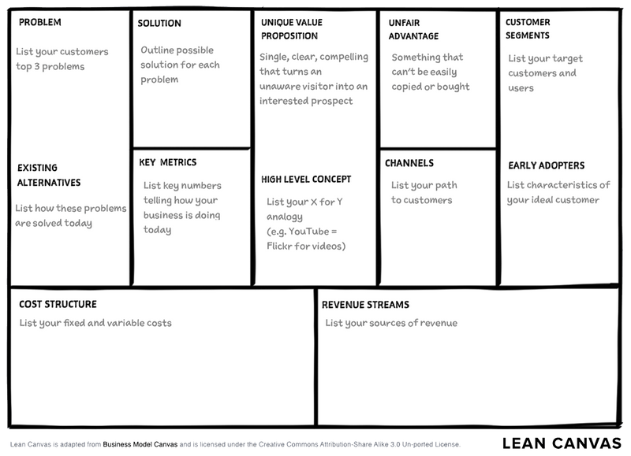

import { Badge } from '@astrojs/starlight/components';

## OSU Advantage Accelerator's Iterate Program

<Badge text="Team Activity" variant="note" class="mb-6" />

Join the [Iterate](https://advantage.oregonstate.edu/advantage-accelerator/programs/iterate) program of the OSU Advantage Accelerator to develop your project idea. This four-workshop program is offered once per school term to inform and prepare you on essential aspects of starting a successful business venture.

:::note
This activity is especially relevant for students with a New Product or Game project. It is recommended to participate in the Fall term cohort.
:::

Check some of the Accelerator's [other resources](https://advantage.oregonstate.edu/innovation-impact-program/student-resources).

For this activity, participate in all four workshops as a team, and write a report that includes all artifacts that you produced during the program.

## Lean Canvas Canvas

<Badge text="Team Activity" variant="note" class="mb-6" />

Complete the [Lean Canvas](https://www.leanfoundry.com/tools/lean-canvas), with as much details as you can.

Something unclear? Look up explanations and some examples online.

Submit your Canvas with any additional information that might be useful to understand it. Consider going more in-depth by detailing the sections of the canvas is a document.

## Hypothesis Testing

<Badge text="Team Activity" variant="note" class="mb-6" />

Most of the information in your **Lean Canvas** are hypotheses. Identify five of the riskier hypotheses in your plan's customer segments, problems, and competition. 

For each hypothesis:

1. Construct a fail/pass test.
2. Interview at least five members of the relevant customer segment (enough to suggest the hypothesis holds or not) and produce anonymized data about the customer interviewed.
3. Provide a clear and professional summary of the results of the test (insights, etc.)
4. If your initial hypothesis is false, provide a pivot hypothesis.

## User Story Mapping (Use Cases and Scenarios)

<Badge text="Team Activity" variant="note" class="mb-6" />

After reading this [User Story Mapping](https://www.nngroup.com/articles/user-story-mapping/) article from the Nielsen Norman Group, create a comprehensive user story map for your project, and include an initial written set of epics and user stories.

## User's Emotional Objectives

<Badge text="Individual Activity" variant="success" class="mb-6"/>

We often focus on users' functional goals, but emotional objectives often play a bigger role in decision-making.

- What emotions is the user seeking when using the software?
- How does the software impact their relationships or self-perception?

For example, a peer resume critique website might meet the functional goal of reviewing resumes, but the emotional objective is to ease job search anxiety. Similarly, in the auto industry, messaging focuses on emotions: a car might make someone feel wealthy or adventurous. How can your software address these emotional needs?

Submit an analysis of your project from the perspective of the user emotional objectives, explain which user segment or audience you are targeting. Share it with your team.

## Domain Model

<Badge text="Team Activity" variant="note" class="mb-6" />

Create a [Domain Model](https://simplea.com/Articles/domain-model) that represents the key entities and relationships within your project's problem space.

- Identify Entities: list the main objects or concepts relevant to the domain (e.g., users, products, orders).
- Define Attributes: for each entity, specify key characteristics or properties (e.g., name, ID, status).
- Establish Relationships: map how entities interact with or relate to one another (e.g., “User places Order”).
- Draw the Model: use diagrams (UML or similar) to visualize the domain.

Submit a diagram along with a brief explanation of the entities and their relationships.

## User Manual

<Badge text="Team Activity" variant="note" class="mb-6" />

Develop a preliminary user manual that outlines how end-users will interact with your software.

- Identify Key Features: list the core features users need to know about.
- User Instructions: provide step-by-step guides on how to use the system, including screen navigation and input details.
- Common Issues and Solutions: include troubleshooting tips for common problems users may face.
- Interface Overview: provide a brief description of the user interface.

Submit a draft of the user manual with clear instructions on using the main features of your system.
