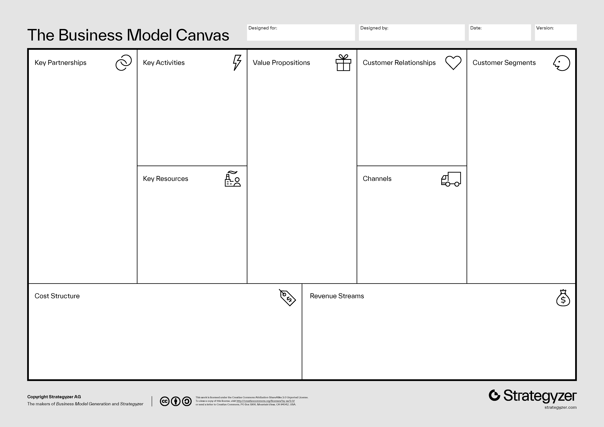

## OSU Advantage Accelerator's Iterate Program

:::note
This activity is especially relevant for students with a New Product or Game project. It is recommended to participate in the Fall term cohort.
:::

Join the [Iterate](https://advantage.oregonstate.edu/advantage-accelerator/programs/iterate) program of the OSU Advantage Accelerator to develop your project idea. This four-workshop program is offered once per school term to inform and prepare you on essential aspects of starting a successful business venture.

Check some of the Accelerator's [other resources](https://advantage.oregonstate.edu/innovation-impact-program/student-resources).

For this activity, participate in all four workshops as a team, and write a report that includes all artifacts that you produced during the program.

## Lean Canvas or Business Model Canvas

Complete either the [Business Model Canvas](https://www.strategyzer.com/library/the-business-model-canvas) or [Lean Canvas](https://www.leanfoundry.com/tools/lean-canvas). Unsure? Read up about their [differences](https://www.leanfoundry.com/articles/why-lean-canvas-versus-business-model-canvas).

{/* Review table or image sizes */}

Business Model Canvas | Lean Canvas
:--------------------:|:--------------------:
  |  

Something unclear? Look up explanations and some examples online.

## Hypothesis Testing

Most of the information in your **Lean Canvas** are hypotheses. Identify five of the riskier hypotheses in your plan's customer segments, problems, and competition. 

For each hypothesis:

1. Construct a fail/pass test.
2. Interview at least five members of the relevant customer segment (enough to suggest the hypothesis holds or not) and produce anonymized data about the customer interviewed.
3. Provide a clear and professional summary of the results of the test (insights, etc.)
4. If your initial hypothesis is false, provide a pivot hypothesis.

## User Story Mapping (Use Cases and Scenarios)

After reading this [User Story Mapping](https://www.nngroup.com/articles/user-story-mapping/) article from the Nielsen Norman Group, create a comprehensive user story map for your project, and include an initial written set of epics and user stories.

{/* ## User's Emotional Objectives */}

## User Activities

:::caution
If you are doing a research project with faculty, and you plan to do user testing, you will need to get [IRB approval](https://research.oregonstate.edu/ori/irb). Tackle this early. It is a lengthy process.
:::

- [UX Research Cheat Sheet](https://www.nngroup.com/articles/ux-research-cheat-sheet/) by Susan Farrell (NN/g)
- [Quantitative User-Research Methodologies: An Overview](https://www.nngroup.com/articles/quantitative-user-research-methods/) by Kate Moran (NN/g)
- [When to Use Which User-Experience Research Methods](https://www.nngroup.com/articles/which-ux-research-methods/) by Christian Rohrer (NN/g)
- [Why You Only Need to Test with 5 Users](https://www.nngroup.com/articles/why-you-only-need-to-test-with-5-users/) by Jakob Nielsen (NN/g)
- [10 Usability Heuristics for User Interface Design](https://www.nngroup.com/articles/ten-usability-heuristics/) by Jakob Nielsen (NN/g)
- [27 Tips and Tricks for Conducting Successful User Research in the Field](https://www.nngroup.com/articles/tips-user-research-field/) by Susan Farrell and Mayya Azarova (NN/g)