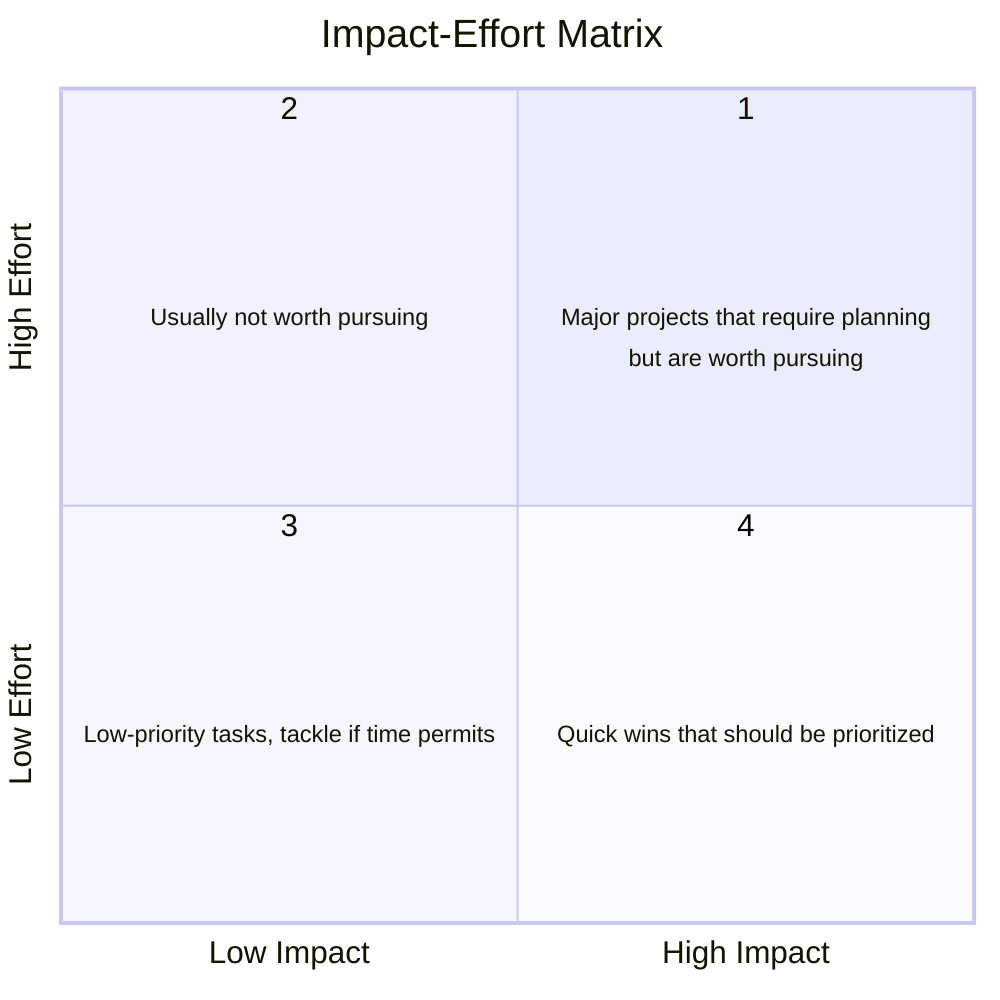
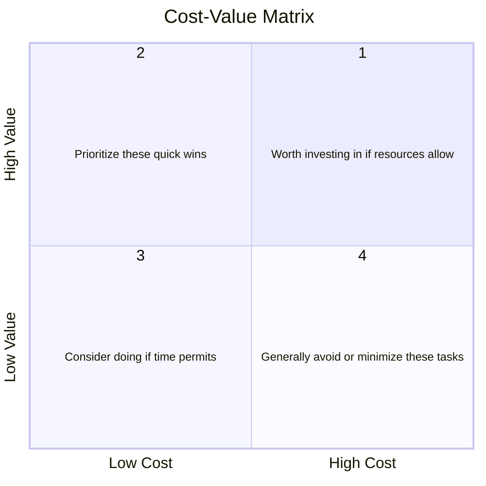

import Cite from '/src/components/Cite.astro';
import References from '/src/components/References.astro';

Your team has a problem to solve, more candidate features than time to build them, and a meeting where everyone argues for a different first step. This page covers three sets of methods for that moment: ideation techniques to widen the options, prioritization methods to rank them, and success-metric frameworks to decide in advance what will count as working. It doesn't cover running the sprint that pulls from the ranked list (see [Sprints](/guides/sprint/)) or writing the requirements themselves (see [Requirements](/guides/requirements/)).

:::note[tl;dr]
- Generate options before you rank them, and have everyone write ideas down alone before the group discusses any of them.
- Ask for quantity first and judge later; the unusual ideas arrive after the obvious ones.
- Rank the backlog with one method, chosen for the argument your team keeps having, and write the reason next to each rank.
- Keep the Must Haves to a share of the effort the team is confident it can deliver, and write the Won't Haves down.
- Protect important work that is never urgent (design, tests, documentation) with a rule you set in advance, such as a Definition of Done.
- Commit two or three success metrics, each with a decision rule, a collection method, and a date, before you see any data.
- Report ratios and per-user figures rather than raw totals, so a metric can go down when things get worse.
:::

The exercises that apply these methods to your project are in the [Creative](/activities/creative/) and [Planning](/activities/planning/) activities.

## What Is a Plan?

A small team's plan is small. It contains:

- **Option set**: the ideas you considered, including the ones you rejected and why, so a later proposal can say what was ruled out and on what grounds.
- **Ranked backlog**: every item of work in order, with a reason for its rank that a teammate can read without you in the room. It's what [sprint planning](/guides/sprint/#sprint-planning) pulls from.
- **Success metrics**: two or three numbers, each with a decision rule, a collection method, and a date, so that "did it work" has an answer someone else can check.

## Ideation Techniques

Brainstorming as a named method comes from Alex Osborn's [*Applied Imagination*](https://archive.org/details/appliedimaginati00osborich) (1953). Most formal sessions still run on his rules: go for quantity, say whatever comes to mind, don't criticize shared ideas, and build on them <Cite id="paulus-2018" form="parenthetical" />. [IDEO's seven rules](https://www.ideou.com/blogs/inspiration/7-simple-rules-of-brainstorming) restate Osborn's and add three for running the session well:

1. Defer judgment: no criticism of ideas during the session.
2. Encourage wild ideas: unrealistic ideas spark realistic ones.
3. Build on the ideas of others.
4. Stay focused on the topic.
5. One conversation at a time.
6. Be visual: sketch, don't only describe.
7. Go for quantity.

Of Osborn's rules, the best evidence is for focusing on quantity first rather than on quality <Cite id="paulus-2018" form="parenthetical" />. <Cite id="paulus-2011" /> compared four brainstorming instructions (no specific focus, a quantity goal, a quality goal, or both) and found that the quantity goal produced more ideas, and more good ideas, than any of the other three.

The group format itself fares worse than its reputation. <Cite id="mullen-1991" /> pooled earlier studies and found brainstorming groups significantly less productive than nominal groups (the same number of people working alone, with their ideas pooled afterward), in both quantity and quality, and more so in larger groups. Groups of four tend to produce only about half as many ideas as four people working alone <Cite id="paulus-2018" form="parenthetical" />. In the last of four experiments, <Cite id="diehl-1987" /> manipulated blocking directly and found that **production blocking** accounted for most of the productivity loss of real brainstorming groups. In a talking group only one person can share an idea at a time, and the others have to hold theirs in mind while they wait <Cite id="paulus-2018" form="parenthetical" />.

The techniques below are structures that work around that loss, mostly by having people generate ideas alone or on paper before the group discusses them. Pick one per session, because each technique is a different set of rules to learn, and a session spent switching between them is a session spent on instructions instead of ideas.

### 6-3-5 Brainwriting

**Brainwriting** is brainstorming on paper, in silence, so the loudest person doesn't set the agenda. In the 6-3-5 variant the name is the recipe: 6 participants, 3 ideas, 5 minutes.

1. Each participant writes 3 ideas on the sheet in front of them within 5 minutes, building on what is already written.
2. Pass sheets one step around the circle.
3. Repeat for 6 rounds.

Six rounds of six people produce 108 ideas in half an hour. Adjust the numbers to your team size and keep the structure: write alone, read what came before, pass it on.

Reach for brainwriting when one or two teammates dominate discussion. Research on passing slips of paper around a group suggests it can be quite effective, and in one short session, writing yielded twice as many ideas as talking <Cite id="paulus-2018" form="parenthetical" />. The meta-analysis points the same way: the group loss was stronger when contributions were spoken aloud than when they were written <Cite id="mullen-1991" form="parenthetical" />.

If the team is remote, brainwrite in a shared document and then discuss the ideas live: <Cite id="paulus-2018" /> report that electronic idea exchange tends to generate more ideas than talking, but that evaluating ideas works better face to face.

### Crazy 8s

Crazy 8s is a sketching exercise from the [Design Sprint](https://www.character.vc/guide/design-sprint), the five-day process Jake Knapp created at Google and published with John Zeratsky and Braden Kowitz in *Sprint* (2016). It's for interface and interaction ideas, and in the sprint it comes after each person has gathered notes and jotted rough ideas alone:

1. Fold a sheet of paper into eight frames.
2. Set an 8-minute timer.
3. Sketch a variation of one of your best ideas in each frame, one minute per sketch.
4. Take the strongest variation into a solution sketch. In the Design Sprint that's a three-panel storyboard, kept anonymous and saved for the team to review the next day.

The one-minute limit forces breadth: you can't polish a sketch in a minute, so you move on to the next variation before committing to the first. The sketching is also done individually, which the authors call "work alone together": they give each person time to develop solutions on their own instead of brainstorming as a group.

Crazy 8s works remotely with a shared whiteboard, or with paper held up to a camera.

### Rolestorming

[Rolestorming](https://www.griggsachieve.com/Rolestorming/), which Rick Griggs published in *Training* magazine in 1985, has each participant generate ideas as someone else: the end user, your project partner's manager, a competitor, the person who has to maintain the code in two years.

1. Assign a role to each participant.
2. Generate ideas from that role's perspective.
3. Share and refine across perspectives, then rotate roles and repeat.

Griggs combined role-playing with brainstorming to keep people on track and to spare them the fear of ridicule: an idea offered as the competitor isn't yours to defend. It shares a mechanism with [Six Thinking Hats](/activities/creative/#six-thinking-hats), since stepping out of your own view surfaces the objections and wants you'd otherwise miss.

### Reverse Brainstorming

Reverse brainstorming asks how to cause the problem, or make it worse, then flips each answer.

1. State the problem.
2. List every way to make it worse.
3. Reverse each item into a candidate solution.
4. Refine the flipped list into actions.

Use it when you're building a risk register, because each way to make things worse is a concrete failure mode you can then plan against. Gary Klein's [premortem](https://hbr.org/2007/09/performing-a-project-premortem) applies the same inversion to a whole plan: the team imagines the project has already failed and lists why. Klein argues that the framing makes it safe for skeptics to voice doubts they'd otherwise keep to themselves during planning.

## Prioritization Methods

Every method below answers the same question, "what first", with a different pair of axes. Pick the pair that matches the argument your team keeps having. Don't run three methods on the same backlog: each ranks a few items differently, and settling those differences takes the time the method was meant to save.

### MoSCoW

The [DSDM Agile Project Framework](https://www.agilebusiness.org/dsdm-project-framework/moscow-prioritisation.html) defines MoSCoW as four buckets:

- **M (Must have)**: the project fails without it. DSDM's test is to ask what happens if it isn't delivered; if the answer is to cancel the project, it's a Must.
- **S (Should have)**: important, and can slip if it has to.
- **C (Could have)**: adds value, and is cut first when time runs short.
- **W (Won't have this time)**: out of scope for now, and written down so nobody re-proposes it next sprint.

MoSCoW is easy to game, because nobody wants their item in Could. DSDM's guard is a cap: typically no more than 60% of the effort on Must Haves, and around 20% on Could Haves as contingency. If your Musts add up to more than that, the sort hasn't happened yet.

### Impact-Effort Matrix

Place each item on two axes, the impact it has if done and the effort it costs to do. Four quadrants fall out:

1. High effort, high impact: major projects; plan them, then do them.
2. High effort, low impact: usually not worth doing.
3. Low effort, low impact: filler, for when you're blocked.
4. Low effort, high impact: quick wins; do these first.

Estimate effort per item before you plot, or the matrix becomes a vote on enthusiasm.

### Eisenhower Matrix

The same shape, with urgency and importance as the axes. It carries Dwight Eisenhower's name because of a [1954 speech](https://www.presidency.ucsb.edu/documents/address-the-second-assembly-the-world-council-churches-evanston-illinois) in which he quoted a former college president: "I have two kinds of problems, the urgent and the important." Stephen Covey turned the distinction into a four-quadrant [time management matrix](https://www.franklincovey.com/courses/the-7-habits/habit-3/) in *The 7 Habits of Highly Effective People* (1989).

Use it on tasks rather than features, because urgency comes from a deadline, and a feature on a backlog rarely has one of its own:

1. Important and urgent: do it now.
2. Important, not urgent: schedule it.
3. Urgent, not important: delegate it if you can.
4. Neither: drop it.

Covey argues that quadrant 2, the important work that isn't urgent (planning, creative thinking, learning), is where time earns the best return. For a software team that's design, tests, and documentation; [Some Truths](#some-truths-about-planning) covers why it keeps losing to whatever is due Friday.

### Cost-Value Matrix

<Cite id="karlsson-1997" /> developed a cost-value approach for the usual situation of more requirements than time, and applied it to two commercial projects. The informal version is a matrix with cost on one axis (for a small team, almost always time) and the value delivered on the other:

1. High value, high cost: invest if the schedule allows.
2. High value, low cost: quick wins; do these first.
3. Low value, low cost: if time permits.
4. Low value, high cost: avoid.

Let whoever the product is for (a project partner, a panel of users) set the value axis, and let the team set the cost. Use the matrix when the team and that person disagree about what matters, because it puts both judgments on one chart.

### Scrum Backlog Ordering

The [Scrum Guide](https://scrumguides.org/scrum-guide.html) doesn't prescribe a scoring method. It prescribes a single ordered Product Backlog, "the single source of work undertaken by the Scrum Team", with one Product Owner accountable for ordering it and each sprint pulling from the top. The ordering can use any matrix above; what Scrum adds is:

- One list, one owner. The Product Owner is "one person, not a committee", and anyone who wants the order changed has to convince that person, so priorities aren't renegotiated in every meeting.
- Value first. The Product Owner is accountable for maximizing the value of the product, so the item that changes the most for the user goes to the top.
- Items small enough to finish. The Guide deems an item ready for selection when the team can get it Done within one sprint.

Add one rule of your own: rank an item below anything that blocks it, because a task pulled into a sprint before its dependency is finished spends the sprint waiting.

### Most Important Task (MIT)

The MIT is a personal method, not a team one. [Leo Babauta](https://zenhabits.net/purpose-your-day-most-important-task/), who calls it "not an original concept", describes it as naming the task you most want or need to get done that day and doing it first thing (he picks three). Start with one: the task that would make the day worth it if it were the only thing you finished. Do it before you open chat or the ticket queue, because either can fill a whole day that ends without a commit.

## Success-Metric Frameworks

A success metric is a number plus a decision rule plus a collection method, committed before you look at the data. The frameworks below are for product and game teams, which have users to count. Research, open-source, and consultancy teams measure different things; the [Identify Success Metrics](/activities/planning/#identify-success-metrics) activity has a subsection for each.

### The Product-Market Fit Question

Sean Ellis's product-market fit survey asks existing users how they would feel if they could no longer use the product, and counts the share who answer "Very disappointed". In [a post](https://web.archive.org/web/20110101140114/http://startup-marketing.com/the-startup-pyramid/), Ellis argues that product-market fit requires at least 40% of users saying they'd be very disappointed. He calls the threshold "a bit arbitrary" and says he set it after comparing results across nearly 100 startups. Below it, he advises keeping spending low and putting everything into raising that percentage.

### Pirate Metrics (AARRR)

Dave McClure's [Startup Metrics for Pirates](https://www.slideshare.net/dmc500hats/startup-metrics-for-pirates-long-version) talk introduced AARRR, which follows a user through five stages. Each stage is a place the funnel can leak:

- **Acquisition**: how do people find the product?
- **Activation**: do they take the first meaningful action (sign up, install, complete a level)?
- **Retention**: do they come back?
- **Referral**: do they tell anyone?
- **Revenue**: will they pay?

For a product with a few dozen users, measure activation and retention first. At that scale, acquisition is mostly the people you told and your public landing page, and revenue is usually out of scope.

### HEART

HEART comes from Google's user experience researchers. <Cite id="rodden-2010" /> describe it as five categories from which a team defines its own metrics. Where AARRR follows a funnel, HEART measures the user's experience:

- **Happiness**: satisfaction, from surveys or ratings.
- **Engagement**: how often and how deeply users interact.
- **Adoption**: how many new users start in a period.
- **Retention**: how many keep using it.
- **Task success**: completion rate, time on task, error rate for the core workflows.

Pick the categories that describe your product's job, and decide explicitly to leave the others out. <Cite id="rodden-2010" /> note that not every category fits every product: Engagement may mean little for an enterprise tool that people use because their work requires it.

<Cite id="rodden-2010" /> pair the framework with a process, Goals-Signals-Metrics: state the goal, name the behavior or attitude that would show it was met, then turn that signal into a number you can track.

## Best Practices for Planning

- Diverge before you converge. Run one ideation technique before the first prioritization pass, even when the answer seems obvious, because the obvious answer is the one everyone already had.
- Have people write ideas down alone before the group discusses them, so nobody spends the session waiting for a turn to speak.
- Write the reason next to the rank, because a backlog order without reasons gets re-argued every sprint.
- Estimate effort before you plot a matrix, and estimate it in hours rather than T-shirt sizes when the project has a fixed end date: hours add up against the hours you have left, and sizes don't.
- Cap the Must Haves at the effort the team is confident it can deliver (DSDM's typical ceiling is 60%), because the Could Haves are the contingency that absorbs a bad estimate without breaking a promise.
- Commit metrics with a date in the repository before you measure, so the results can't choose the metric for you.
- Name the instrument for each metric (analytics, a database count, a benchmark script, a survey), because a metric with no collection plan never gets a number.
- Re-rank when new information arrives rather than on a fixed schedule, because that's when an item's value changes. [Sprints](/guides/sprint/#sprint-planning) covers keeping the backlog current between plannings.

## Some Truths About Planning

The uncomfortable part first: most of the prioritization methods on this page are the same two-by-two with different axis labels. Impact against effort, value against cost, urgent against important: each asks you to place an item on two scales nobody can measure precisely and then read off a quadrant. The value isn't in where an item lands, since a teammate would plot it a square over. It's in the argument the team has while plotting, which surfaces the assumption one person held and nobody else shared, and that's why the reason written next to a rank is worth more than the rank.

A plan made at the start of a project is written with the least information you'll ever have, so expect to rewrite much of it within a month or two. Write it down anyway, because the gap between what you expected and what happened tells you how far off your estimates run, and without a written expectation there's no gap to measure.

The Eisenhower matrix names a trap it can't fix. Design documents, tests, and documentation sit in the important-but-not-urgent quadrant, and something urgent keeps arriving to displace them. Across five experiments, <Cite id="zhu-2018" /> found that people were more likely to choose unimportant tasks with objectively lower payoffs over important ones when the unimportant tasks merely looked urgent, for instance through an illusion of expiration. Don't count on a re-ranking under deadline pressure to resist that pull. Make the commitment in advance and write it down, such as a [Definition of Done](/guides/sprint/#definition-of-done) that won't accept a merge without tests.

Vanity metrics are seductive because they only go up. Downloads, page views, and stars accumulate whether or not anyone got value. [Eric Ries argues](https://www.startuplessonslearned.com/2009/12/why-vanity-metrics-are-dangerous.html) that a vanity metric such as total hits is a gross number rather than a per-customer one, and carries no built-in measure of what caused it. <Cite id="rodden-2010" /> make the same point about seven-day active users: the count doesn't separate new users from returning ones, and with complete turnover of the user base every week it could still rise. They recommend normalizing raw counts, which go up as the user base grows, into ratios, percentages, or per-user averages.

Small samples deserve the same suspicion. The product-market fit share is meaningful across dozens of respondents; with eight users, one answer moves it by twelve percentage points, so 38% and 50% are one person apart. Rahul Vohra, who ran the survey at Superhuman, [argues](https://review.firstround.com/how-superhuman-built-an-engine-to-find-product-market-fit/) that results start to be directionally correct around 40 respondents. Report the count alongside the share, so a reader can see how much weight the number can bear.

Brainstorming sessions produce mostly ordinary ideas at first, and that's expected. The **serial order effect**, the tendency for later ideas in a session to be more creative than earlier ones, is one of the oldest and most robust findings in modern creativity research <Cite id="beaty-2012" form="parenthetical" />; people retrieve the obvious, common ideas first and the rarer ones later <Cite id="paulus-2018" form="parenthetical" />. A session that stops at the first plausible idea has skipped the part it existed for, which is why the rules above put quantity before judgment.

Generating an original idea doesn't mean the team will pick it. <Cite id="paulus-2018" /> describe a feasibility bias in selection, and some evidence that groups that generate many ideas go on to select less original ones. Agree on the selection criteria before anyone votes, and make novelty one of them if the project needs it, because a vote with no stated criteria leaves that bias free to pick for you.

## Planning and Prioritization in Industry and Academia

Product teams have their own variants of the matrices. Intercom's [RICE score](https://www.intercom.com/blog/rice-simple-prioritization-for-product-managers/) (reach, impact, confidence, effort) adds a confidence term to the impact-effort plot, which Sean McBride argues curbs enthusiasm for exciting but ill-defined ideas.

Other companies decide what to build by writing first. Amazon's Working Backwards, as [Werner Vogels describes it](https://www.allthingsdistributed.com/2006/11/working_backwards.html), starts product definition from the documents needed at launch, the press release and the FAQ, and works back toward the implementation.

Metric frameworks come from practice too. <Cite id="rodden-2010" /> applied HEART and Goals-Signals-Metrics to more than 20 products and projects at Google. Vohra's account of Superhuman shows the product-market fit survey used to segment users: the people who answered "Very disappointed" narrowed down which users the product was for.

In research, the equivalent of committing a metric with a date is **preregistration**: defining the research questions and analysis plan before observing the outcomes <Cite id="nosek-2018" form="parenthetical" />. Nosek and colleagues present it as an effective guard against mistaking an explanation found in the data for a prediction made beforehand, a mistake that hindsight bias (seeing an outcome as more predictable after the fact than before it) makes hard to avoid. They note that preregistration is required for clinical trials, both by US law and by journals that follow the International Committee of Medical Journal Editors policy. The Center for Open Science lists [over 300 journals](https://www.cos.io/initiatives/registered-reports) that offer Registered Reports, in which peer review of the question and method happens before data collection, among them PeerJ Computer Science and Frontiers in Computer Science. The ranked backlog has a research equivalent too: the experiment plan, which says which runs come first, which baselines they compare against, and what result would end the line of inquiry.

In open source, prioritization is public. GitHub creates a set of [default labels](https://docs.github.com/en/issues/using-labels-and-milestones-to-track-work/managing-labels) in every new repository, including `good first issue`, `help wanted`, and `wontfix`, and `wontfix` does the job of MoSCoW's Won't Have, on the record. Before you contribute to a project, read how it labels and ranks its issues, because that tells you whether a patch will be reviewed soon or wait.

## References

<References />

## Additional Readings

**Sources and further reading**

- [User Story Mapping](https://jpattonassociates.com/story-mapping/), Jeff Patton
- [The Four Big Risks](https://www.svpg.com/four-big-risks/), Marty Cagan
- [Yagni](https://martinfowler.com/bliki/Yagni.html), Martin Fowler
- [Beyond Productivity Loss in Brainstorming Groups](https://doi.org/10.1016/S0065-2601%2810%2943004-X), Wolfgang Stroebe, Bernard Nijstad, and Eric Rietzschel
- [HARKing: Hypothesizing After the Results Are Known](https://doi.org/10.1207/s15327957pspr0203_4), Norbert Kerr
- [Trustworthy Online Controlled Experiments](https://experimentguide.com/), Ron Kohavi, Diane Tang, and Ya Xu

**Activities that exercise this**

- [Identify Success Metrics](/activities/planning/#identify-success-metrics): with a variant for each kind of project.
- [Dependency Mapping or Critical Path Analysis](/activities/planning/#dependency-mapping-or-critical-path-analysis): finds what has to happen first, and what is waiting on someone else.
- [Prioritization](/activities/planning/#prioritization): the methods above applied to your own backlog.
- [How Might We Questions](/activities/planning/#how-might-we-questions) and [Brainstorming Ideas](/activities/creative/#brainstorming-ideas): the divergent half, before prioritization narrows it.
- [Risk Management Plan](/activities/planning/#risk-management-plan): what the plan does about the things that could stop it.
- [Gantt Chart](/activities/planning/#gantt-chart) and [SWOT Analysis](/activities/planning/#swot-analysis): the schedule and the situation, for teams that want the classical forms.
- [Stakeholder Mapping](/activities/planning/#stakeholder-mapping): who has to be consulted before a plan is real.
- [Fishbone Diagram](/activities/planning/#fishbone-diagram): root-cause analysis, for when the plan keeps failing the same way.
- [Plan Prototype](/activities/planning/#plan-prototype): scoping the smallest thing that answers the question.
- [The Mom Test](/activities/creative/#the-mom-test): how to ask about a need without getting the answer you want to hear.
- [Design Sprint](/activities/creative/#design-sprint), [Apply the SCAMPER Method](/activities/creative/#apply-the-scamper-method), and [Apply the C-K Theory](/activities/creative/#apply-the-c-k-theory): structured ideation beyond brainstorming.
- [Write a Literature Review](/activities/creative/#write-a-literature-review): the research team's version of surveying what already exists.
