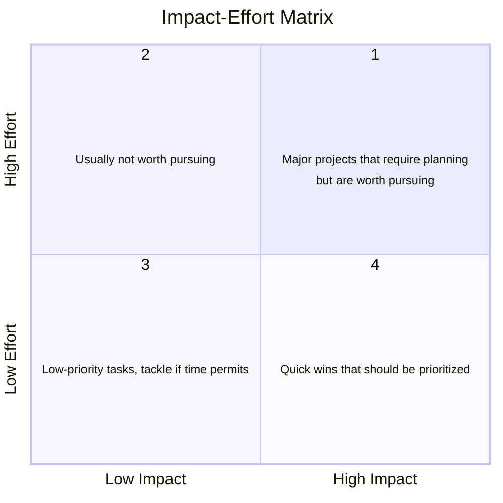
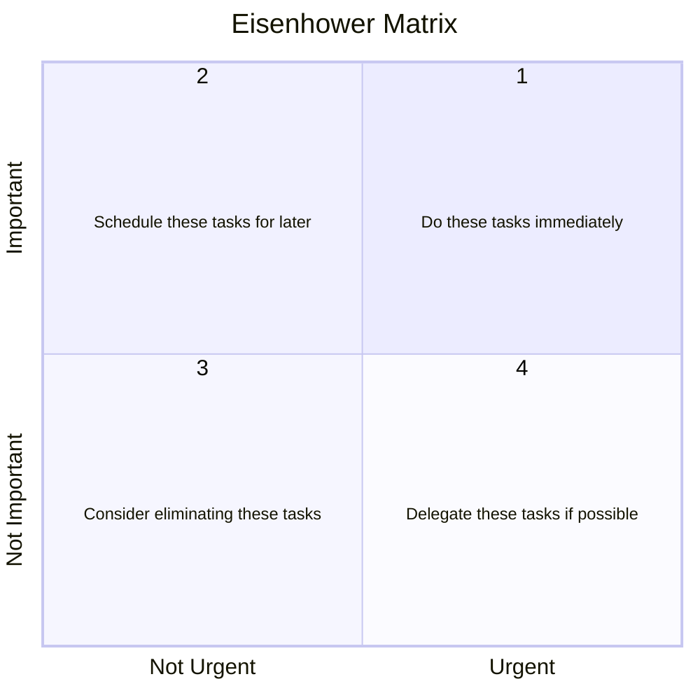
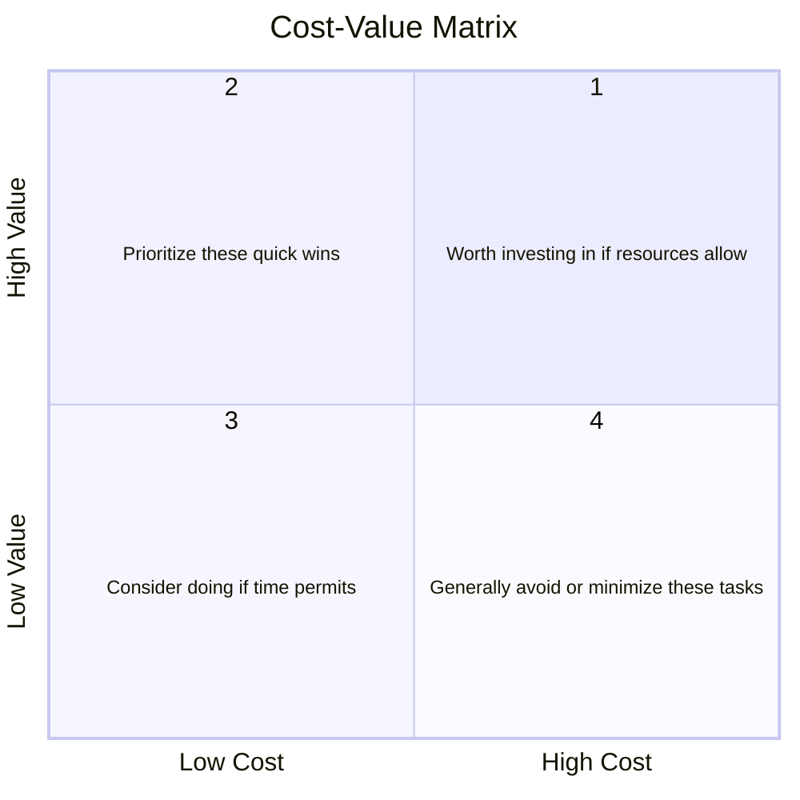

import { LinkCard } from '@astrojs/starlight/components';

Read this when the team has more ideas than time or no way to rank them; it gives you the methods for choosing what to build and measuring it.

Planning is deciding, in order, three things: what could we build, what do we build first, and how will we know it worked. Each question has a well-worn set of methods, and most of them fit on an index card. This guide is the catalog. The exercises that apply them to your project live in the [Creative](/activities/creative/) and [Planning](/activities/planning/) activities.

Without deliberate planning:

- The team builds the first idea anyone said out loud, because nobody generated a second one.
- The backlog is ordered by who argued loudest, and the top item changes every stand-up.
- "Success" gets defined after the results are in, which is how honest people produce misleading work.
- Status updates report activity instead of progress, because nothing was ranked and nothing was measured.

None of the methods below is hard. The failure mode is not picking one.

## What Is a Plan?

A capstone plan is small. It contains:

- **An option set**: the ideas you considered, including the ones you rejected and why. This is the raw material for any proposal you write later.
- **A ranked backlog**: every item of work in order, with a reason for its rank that a teammate can read without you in the room. This is what [sprint planning](/guides/sprint/#sprint-planning) pulls from.
- **Two or three success metrics**, each with a decision rule, a collection method, and a date. Without these, "did it work" has no answer.

The three sections that follow give you a menu for each.

## Ideation Techniques

Brainstorming works when the rules are enforced and fails when they are not. [IDEO's seven rules](https://www.ideou.com/blogs/inspiration/7-simple-rules-of-brainstorming) extend the four Alex Osborn published in 1953:

1. Defer judgment: no criticism of ideas during the session.
2. Encourage wild ideas: unrealistic ideas spark realistic ones.
3. Build on the ideas of others.
4. Stay focused on the topic.
5. Quantity over quality.
6. One conversation at a time.
7. Be visual: sketch, do not only describe.

Osborn's original four are the first three plus quantity; the last three are IDEO's additions for running the session well. The techniques below are structures that make the rules easier to keep. Pick one per session. If the team is remote, [How to Brainstorm Remotely](https://hbr.org/2020/07/how-to-brainstorm-remotely) covers the logistics.

### 6-3-5 Brainwriting

[Brainwriting](https://zapier.com/blog/brainwriting/) is brainstorming on paper, in silence, so the loudest person does not set the agenda. The name is the recipe: **6** participants, **3** ideas, **5** minutes.

1. Each participant writes 3 ideas on the sheet in front of them within 5 minutes, building on what is already written.
2. Pass sheets one step around the circle.
3. Repeat for 6 rounds.

Six rounds of six people produces 108 ideas in half an hour. Adjust the numbers to your team size and keep the structure. This is the technique to reach for when one or two teammates dominate discussion.

### Crazy 8s

[Crazy 8s](https://blog.prototypr.io/how-to-run-a-crazy-eights-workshop-60d0a67b29a) is a sketching sprint for interface or interaction ideas.

1. Fold a sheet of paper into eight sections.
2. Set an 8-minute timer.
3. Each participant sketches 8 different ideas, one per section, one minute each. A caption per sketch helps you explain it later.
4. Put every sheet on the wall and let everyone vote, for instance with stickers.

The one-minute limit is the point: it forces breadth before anyone falls in love with a single design. Crazy 8s [works remotely](https://uxdesign.cc/how-to-do-crazy-8s-remotely-223d7fbd5e98) with a shared whiteboard.

### Rolestorming

[Rolestorming](https://business.tutsplus.com/tutorials/what-is-rolestorming-group-brainstorming-method--cms-27245) has each participant generate ideas as someone else: the end user, the project partner's boss, a competitor, the person who has to maintain the code in two years.

1. Assign a role to each participant.
2. Generate ideas from that role's perspective.
3. Share and refine across perspectives, then rotate roles and repeat.

It shares a mechanism with [Six Thinking Hats](/activities/creative/#six-thinking-hats): stepping out of your own view surfaces the objections and wants you would otherwise miss. A [longer treatment](https://fourweekmba.com/rolestorming/) covers variants.

### Reverse Brainstorming

[Reverse brainstorming](https://online.visual-paradigm.com/knowledge/brainstorming/what-is-reverse-brainstorming/) asks how to cause the problem, or make it worse, then flips each answer.

1. State the problem.
2. List every way to make it worse.
3. Reverse each item into a candidate solution.
4. Refine the flipped list into actions.

It is the fastest way to find failure modes for a risk register, and it is usually more fun than the forward version.

<LinkCard
  title="Brainstorming Ideas"
  href="/activities/creative/#brainstorming-ideas"
  description="Run one of these techniques on your project and keep the shortlist."
/>

## Prioritization Methods

Every method below answers the same question, "what first", with a different pair of axes. Pick the pair that matches the argument your team keeps having. Do not run three methods on the same backlog; the disagreements between them will eat the time you saved.

### MoSCoW

Sort each item into one of four buckets:

- **M (Must have)**: the project fails without it.
- **S (Should have)**: important, and can slip if it has to.
- **C (Could have)**: adds value, cut first when time runs short.
- **W (Won't have)**: out of scope for now, and written down so nobody re-proposes it next sprint.

MoSCoW is the fastest method and the easiest to game: if more than a third of the backlog is a Must, the sort has not happened yet.

### Impact-Effort Matrix

Place each item on two axes, the impact it has if done and the effort it costs to do. Four quadrants fall out:

1. High effort, high impact: major projects; plan them, then do them.
2. High effort, low impact: usually not worth doing.
3. Low effort, low impact: filler, for when you are blocked.
4. Low effort, high impact: **quick wins, do these first.**

Estimate effort per item before you plot, or the matrix becomes a vote on enthusiasm.

### Eisenhower Matrix

The same shape with urgency and importance as the axes. It ranks tasks better than features:

1. Important and urgent: **do it now**.
2. Important, not urgent: schedule it.
3. Not important, not urgent: drop it.
4. Not important, urgent: delegate it if you can.

The trap is quadrant 2. Design work, tests, and documentation are important and never urgent, which is why they get displaced by whatever is due Friday.

### Cost-Value Matrix

Cost on one axis (for a student team, almost always time) and the value delivered on the other:

1. High value, high cost: invest if the schedule allows.
2. High value, low cost: **quick wins, first.**
3. Low value, low cost: if time permits.
4. Low value, high cost: avoid.

Cost-value is impact-effort with the value axis defined by your project partner rather than by the team. Use it when the two disagree.

### Scrum Backlog Ordering

Scrum does not prescribe a scoring method. It prescribes a single, ordered [product backlog](/guides/sprint/#sprint-planning), owned by one person, from which each sprint pulls the top items. The ordering can use any matrix above; what Scrum adds is:

- **One list, one owner.** Priorities are not renegotiated in every meeting.
- **Value first.** The item that changes the most for the user goes to the top.
- **Dependencies respected.** An item is only ready when nothing above it blocks it. A backlog that lets you pull a task you cannot finish is not ordered yet.

### Most Important Task (MIT)

A personal method, not a team one. Each morning name the single task that, if it were the only thing you finished today, would make the day worth it. Do it first. Everything else is a bonus. It is the cheapest defense against a day of Slack and ticket grooming that ends with no commit.

<LinkCard
  title="Prioritization"
  href="/activities/planning/#prioritization"
  description="Pick one method, apply it to your backlog, and produce the ranked list with a reason per rank."
/>

## Success-Metric Frameworks

A metric is a number plus a decision rule plus a collection method, committed before you look at the data. The frameworks below are for product and game teams, which have users to count. Research, FOSS, and consultancy teams measure different things; the [Identify Success Metrics](/activities/planning/#identify-success-metrics) activity has a subsection for each.

### The Product-Market Fit Question

Sean Ellis's product-market fit survey asks users one question: "How would you feel if you could no longer use this product?" The answers are "Very disappointed", "Somewhat disappointed", and "Not disappointed". If two in five users or more answer "Very disappointed", the product has found its market. Below that, work on the product before working on growth. One question, one number, and it fits in a Google Form.

### Pirate Metrics (AARRR)

Dave McClure's [AARRR framework](https://www.productplan.com/glossary/aarrr-framework/) follows a user through five stages, and each stage is a place the funnel can leak:

- **Acquisition**: how do people find the product?
- **Activation**: do they take the first meaningful action (sign up, install, complete a level)?
- **Retention**: do they come back?
- **Referral**: do they tell anyone?
- **Revenue**: will they pay?

For a capstone project, activation and retention are the two that matter. Acquisition is mostly your public landing page, and revenue is usually out of scope.

### HEART

Google's [HEART framework](https://www.heartframework.com/) measures user experience rather than the funnel:

- **Happiness**: satisfaction, from surveys or ratings.
- **Engagement**: how often and how deeply users interact.
- **Adoption**: how many new users start in a period.
- **Retention**: how many keep using it.
- **Task success**: completion rate, time on task, error rate for the core workflows.

Pick the one or two letters that describe your product's job. A tool used once a quarter does not need an engagement metric; a game does not need task success.

<LinkCard
  title="Identify Success Metrics"
  href="/activities/planning/#identify-success-metrics"
  description="Commit two or three metrics with decision rules and a collection method, dated."
/>

## Best Practices for Planning

- Diverge before you converge. Run one ideation technique before the first prioritization pass, even if the answer seems obvious.
- Write the reason next to the rank. A backlog order without reasons gets re-litigated every sprint.
- Estimate effort before plotting a matrix, and estimate it in hours, not T-shirt sizes, for a nine-month project with a fixed end date.
- Cap the Must-haves. If a third of the backlog is essential, nothing is.
- Commit metrics with a date in the repository, then measure. Choosing the metric after seeing the results is the most common way to fool yourself.
- Name the instrument. A metric with no collection plan (analytics, database count, benchmark script, survey) is a wish.
- Re-rank after every project partner meeting, not at the start of every sprint. The backlog is a living document.

## Some Truths About Planning

The honest version first: most of the prioritization methods on this page are the same two-by-two with different axis labels. Impact against effort, value against cost, urgent against important: each asks you to place an item on two scales nobody can measure precisely and then read off a quadrant. The value is not in where an item lands, because a teammate would plot it a square over. It is in the argument the team has while plotting, which surfaces the assumption one person held and nobody else shared, and that is why the reason written next to a rank matters more than the rank.

A plan made at the start of a project will be wrong within a month or two, and that is not a failure of planning. You wrote it with the least information you will ever have. The point of writing it down is that you notice when reality departs from it: the gap between what you expected and what happened is the most useful signal a team gets, and a team with no written expectation cannot see the gap at all.

The Eisenhower matrix names a trap it cannot fix. Design documents, tests, and documentation live in the important-but-not-urgent quadrant, and something urgent arrives every week to displace them. No prioritization method changes that, because the method only tells you what you already knew. What changes it is a commitment made in advance and written down, such as a [Definition of Done](/guides/sprint/#definition-of-done) that will not accept a merge without tests, so the decision is not re-made under deadline pressure each time.

Vanity metrics are seductive because they only go up. Downloads, page views, and stars accumulate whether or not anyone got value, so they reward activity rather than outcome; [Eric Ries named the problem](https://www.startuplessonslearned.com/2009/12/why-vanity-metrics-are-dangerous.html) in the lean-startup writing that popularized the term. A metric earns its place when a bad result would change what you do next, and a number that can only rise cannot tell you that.

Small samples deserve the same suspicion. The product-market fit question is meaningful across dozens of respondents; with eight users, one answer moves the share by twelve percentage points, so 38 percent and 50 percent are one person apart. Report the count alongside the share, so a reader can see how much weight the number can bear.

Brainstorming sessions produce mostly bad ideas, and that is by design. The obvious ideas come out first because they are the ones everyone already had, and the less obvious ones surface only after those are on the wall. A session that stops at the first plausible idea has skipped the part it existed for, which is why the rules above insist on quantity before judgment.

Teams skip prioritization when everything feels urgent, which is exactly when it matters most. Urgency makes every item feel like a Must, and a ranking is the only instrument a team has for saying no to something on purpose rather than by running out of time.

## Planning and Prioritization in Industry and Academia

Product teams at companies like Atlassian, Spotify, and Intercom run some form of the impact-effort or cost-value plot every quarter, usually as a RICE score (reach, impact, confidence, effort) that adds a confidence term to the matrix. Amazon's Working Backwards starts from the press release and FAQ, which is reverse brainstorming applied to a launch. Google's HEART framework came out of its UX research team and is used alongside AARRR-style funnel dashboards in most consumer products. The PMF question is the standard growth-stage survey at venture-backed startups, and the two-in-five threshold is the number investors ask about.

In research, the equivalent of committing a metric with a date is pre-registration: stating the hypothesis, the primary measure, and the analysis plan before collecting data. Journals in psychology and medicine increasingly require it, and computational fields are adopting it through registered reports. The prioritization equivalent is the experiment plan: which runs first, which baselines, and what result would end the line of inquiry.

In open source, prioritization is public. Maintainers triage issues with labels (`good first issue`, `help wanted`, `wontfix`) that are MoSCoW by another name, and roadmaps are ranked backlogs anyone can read. Reading how a project you contribute to ranks its work tells you where your patch will land.

## Additional Readings

Most prioritization frameworks are the same small set of ideas with different
labels, so the entries below are chosen for the ones that add something: a
scoring model you can argue with, a mapping technique that produces a release
line, and the product writing on what actually needs deciding first.

**Sources and further reading**

- [RICE scoring](https://www.intercom.com/blog/rice-simple-prioritization-for-product-managers/), Intercom: reach, impact, confidence, effort, and the honest note that confidence is the term doing the work.
- [MoSCoW method](https://en.wikipedia.org/wiki/MoSCoW_method): must, should, could, will not, and why the last category is the useful one.
- [User Story Mapping](https://www.nngroup.com/articles/user-story-mapping/), Nielsen Norman Group: how a horizontal line through a map of stories becomes a release.
- [The Eisenhower matrix](https://www.eisenhower.me/eisenhower-matrix/): urgent against important, and the quadrant where design docs quietly die.
- [The four big risks](https://www.svpg.com/four-big-risks/), Marty Cagan: value, usability, feasibility, and viability, which is a better checklist than any 2x2 on this page.
- [Yagni](https://martinfowler.com/bliki/Yagni.html), Martin Fowler: the argument against building for a future you are guessing at.
- [How Superhuman Built an Engine to Find Product/Market Fit](https://review.firstround.com/how-superhuman-built-an-engine-to-find-product-market-fit/), First Round Review: the source of the PMF survey question this guide uses, including its sample-size caveats.

**Activities that exercise this**

- [Identify Success Metrics](/activities/planning/#identify-success-metrics): with a variant for each kind of project.
- [Dependency Mapping or Critical Path Analysis](/activities/planning/#dependency-mapping-or-critical-path-analysis): finds what has to happen first, and what is waiting on someone else.
- [Prioritization](/activities/planning/#prioritization): the methods above applied to your own backlog.
- [How Might We Questions](/activities/planning/#how-might-we-questions) and [Brainstorming Ideas](/activities/creative/#brainstorming-ideas): the divergent half, before prioritization narrows it.
- [Risk Management Plan](/activities/planning/#risk-management-plan): what the plan does about the things that could stop it.
- [Gantt Chart](/activities/planning/#gantt-chart) and [SWOT Analysis](/activities/planning/#swot-analysis): the schedule and the situation, for teams that want the classical forms.
- [Stakeholder Mapping](/activities/planning/#stakeholder-mapping): who has to be consulted before a plan is real.
- [Fishbone Diagram](/activities/planning/#fishbone-diagram): root-cause analysis, for when the plan keeps failing the same way.
- [Plan Prototype](/activities/planning/#plan-prototype): scoping the smallest thing that answers the question.
- [The Mom Test](/activities/creative/#the-mom-test): how to ask about a need without getting the answer you want to hear.
- [Design Sprint](/activities/creative/#design-sprint), [Apply the SCAMPER Method](/activities/creative/#apply-the-scamper-method), and [Apply the C-K Theory](/activities/creative/#apply-the-c-k-theory): structured ideation beyond brainstorming.
- [Write a Literature Review](/activities/creative/#write-a-literature-review): the research team's version of surveying what already exists.
