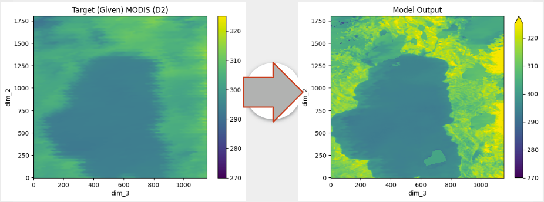

import { Badge, LinkButton } from '@astrojs/starlight/components';

We list some noteworthy past projects. More projects will be added soon!

{/* TODO: improve layout, have clickable badges for GitHub or Website + Award */}
{/* TODO: FeedBias, AI in Psychology */}
{/* TODO: add app stores for ephira */}
{/* TODO: check claude to see if other usefull info to add, like tech stack for different projects */}

## Lavender (2024-2025)

<Badge text="New Product" variant="note" class="my-6" size="small"/>
<Badge text="Web" variant="success" class="my-6" size="small"/>

Lavender is a digital platform designed to manage shift-related sleep challenges by allowing users to track and visualize daily sleep entries, work and activity schedules, and sleep quality trends, while providing personalized support through custom sleep schedule recommendations, insights to reduce fatigue and insomnia, and tools for provider collaboration. 

The platform enables providers to monitor sleep patterns, view sleep diary entries, track key sleep metrics, and access activity logs, offering auto-generated optimized sleep schedules based on research or manually added custom recommendations that can be sent directly to participants' calendars.

  <LinkButton
    href="https://lavender-app.github.io/lavender/"
    variant="secondary"
    icon="external"
    iconPlacement="start"
    target="_blank"
  >
    Website
  </LinkButton>

## The Robot Underground (2024-2025)

<Badge text="New Game" variant="note" class="my-6" size="small"/>
<Badge text="Unreal Engine" variant="success" class="my-6" size="small"/>
<Badge text="Graphics" variant="success" class="my-6" size="small"/>

The Robot Underground™ aims to break open tech education for middle and high schoolers everywhere, even if they live in a robot wasteland. 

The team built a demo for an immersive robotics video game that catapults the player into a world of building, wiring, and programming increasingly difficult robots in order to unravel a tantalizing mystery.

Built on top of a [comprehensive robotics curriculum](https://robotunderground.party/), players can walk in with zero skills and walk out prepared to dive into a technical college major.

  <LinkButton
    href="https://github.com/sicktronics/The-Robot-Underground-Demo"
    variant="secondary"
    icon="github"
    iconPlacement="start"
    target="_blank"
  >
    The Robot Underground on GitHub
  </LinkButton>
  <LinkButton
    href="https://therobotunderground.itch.io/the-robot-underground-demo"
    variant="secondary"
    icon="cloud-download"
    iconPlacement="start"
    target="_blank"
  >
    itch.io Demo
  </LinkButton>

## Ephira (2024-2025)

<Badge text="New Product" variant="note" class="my-6" size="small"/>
<Badge text="Mobile" variant="success" class="my-6" size="small"/>

Stay aware of your cycle without sacrificing your privacy. Ephira is a secure period-tracker that keeps your data encrypted locally on your device. 

Log menstrual flow, symptoms, moods, medications, birth control, and notes. Data is encrypted and never leaves your device. It can be locked behind biometrics (Face ID/Fingerprint) or a custom password, and can be deleted at any time. 

  <LinkButton
    href="https://github.com/adulbrich/ephira"
    variant="secondary"
    icon="github"
    iconPlacement="start"
    target="_blank"
  >
    Ephira on GitHub
  </LinkButton>
  <LinkButton
    href="https://ephira.capucity.be/"
    variant="secondary"
    icon="external"
    iconPlacement="start"
    target="_blank"
  >
    Website
  </LinkButton>

## Corvallis Connect (2024-2025)

<Badge text="Pacific Power Award" variant="danger" class="my-6" size="small"/>
<Badge text="New Product" variant="note" class="my-6" size="small"/>
<Badge text="Mobile" variant="success" class="my-6" size="small"/>

Corvallis Connect is a civic engagement mobile application that empowers residents of Corvallis, Oregon to easily report issues directly to the city--from potholes and broken streetlights to public safety concerns.

Built with Flutter and powered by Firebase, this project aims to streamline local government communication and create a cleaner, safer, and more responsive community.

  <LinkButton
    href="https://malikhum.github.io/Corvallis_Connect/"
    variant="secondary"
    icon="external"
    iconPlacement="start"
    target="_blank"
  >
    Website
  </LinkButton>

## NextJudge (2023-2024)

<Badge text="New Product" variant="note" class="my-6" size="small"/>
<Badge text="Web" variant="success" class="my-6" size="small"/>

NextJudge is a suite of services, tools, and applications for creating programming platforms (framework), facilitating programming contests (cli tool), and showcasing programming prowess (platform). The primary product is the [NextJudge](https://web.archive.org/web/20240925165513/https://nextjudge.vercel.app/) platform, built with competitive programming in mind.

The NextJudge toolchain comprises a secure code-execution engine, an API gateway, a web application, a CLI tool, and a data layer, all of which are 100% self-hostable.

  <LinkButton
    href="https://github.com/NextJudge/NextJudge"
    variant="secondary"
    icon="github"
    iconPlacement="start"
    target="_blank"
  >
    NextJudge on GitHub
  </LinkButton>
  <LinkButton
    href="https://nextjudge.vercel.app/"
    variant="secondary"
    icon="external"
    iconPlacement="start"
    target="_blank"
  >
    Website
  </LinkButton>

## The Unknown Venome (2023-2024)

<Badge text="Consultancy" variant="note" class="my-6" size="small"/>
<Badge text="Web" variant="success" class="my-6" size="small"/>
<Badge text="Visualization" variant="success" class="my-6" size="small"/>

[The Unknown Venome](https://web.archive.org/web/20240925171611/https://venom-biochem-lab.github.io/venome-poster/) is a platform that stores, visualizes, and analyzes the Venom Biochemistry Lab's Proteins at Oregon State University. 

Search and filter hundreds of venom proteins, view their 3D structure and computed algorithms, and compare with similar proteins such as Foldseek or TM-Align.

  <LinkButton
    href="https://github.com/Venom-Biochem-Lab/venome"
    variant="secondary"
    icon="github"
    iconPlacement="start"
    target="_blank"
  >
    The Unknown Venome on GitHub
  </LinkButton>
  <LinkButton
    href="https://venome.cqls.oregonstate.edu/"
    variant="secondary"
    icon="external"
    iconPlacement="start"
    target="_blank"
  >
    Website
  </LinkButton>

## Immersive Animal Anatomy Visualizer (2023-2024)

<Badge text="Consultancy" variant="note" class="my-6" size="small"/>
<Badge text="AR/VR" variant="success" class="my-6" size="small"/>
<Badge text="Visualization" variant="success" class="my-6" size="small"/>

Helping Veterinary students learn anatomy through an environment that allows for immersive, collaborative studying in VR.

Studying anatomy in VR offers an interactive, hands-on experience that allows users to engage with models in a dynamic way, unlike static textbook learning. In this virtual environment, users can explore, move, and manipulate anatomical structures, making it easier to understand complex details through direct interaction.

The [Immersive Animal Anatomy Visualizer](https://extended-reality-lab.github.io/projects/immersive-animal-anatomy-visualizer) is distributed via the Oculus App Lab, this means updates/changes can be easily downloaded by users like any other applications on the Oculus Quest 2. 

  <LinkButton
    href="https://github.com/Extended-reality-Lab/Immersive-Animal-Anatomy"
    variant="secondary"
    icon="github"
    iconPlacement="start"
    target="_blank"
  >
    Immersive Animal Anatomy on GitHub
  </LinkButton>

## Spatiotemporal Temperature Fusion Network & StarFM (2023-2024)

<Badge text="Research" variant="note" class="my-6" size="small"/>
<Badge text="Simulation" variant="success" class="my-6" size="small"/>

Using machine learning to turn unreadable or missing satellite images into usable and rich data.

The Spatiotemporal Temperature Fusion Network (STTFN) is a multiscale convolutional neural network used for modeling nonlinear relationships in Land Surface Temperature (LST) satellite imagery. It predicts missing or damaged data by using two convolutional networks to generate forward and backward sequences, inferring a “middle” sequence. The model leverages MODIS (low-resolution) and Landsat (high-resolution) satellite data to estimate high-quality LST images. The implementation, trained on Oregon State University's HPC Clusters, uses metrics like RMSE and SSIM for performance and includes a comparison with the STARFM model.

  <LinkButton
    href="https://github.com/Todd-C-Goldfarb/STTFN-OSU"
    variant="secondary"
    icon="github"
    iconPlacement="start"
    target="_blank"
  >
    STTFN-OSU on GitHub
  </LinkButton>
  {/* https://web.archive.org/web/20240925172356/https://todd-c-goldfarb.github.io/STTFN-OSU/ */}

